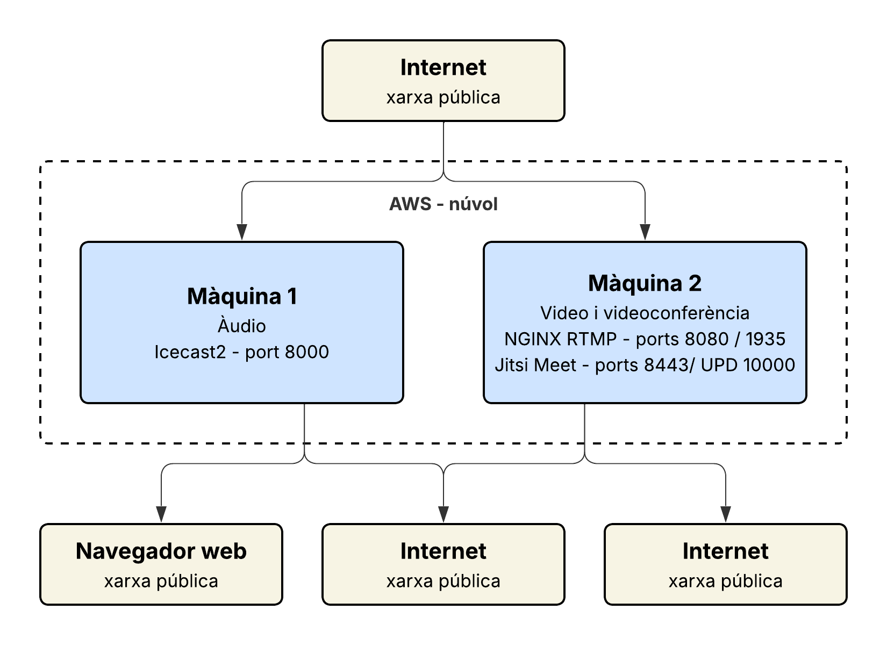

## 2.2 Servei d'àudio
### 2.2.1 Descripció del servei
El servei d'audio permet la distribució de contingut sonor en temps real (streaming en directe) i sota demanda (on-demand) a través de la xarxa. Funciona amb una arquitectura client-servidor: el servidor rep una font d'àudio, la codifica en un format estàndard i la distribueix a múltiples clients simultàniament.
Per a Innovatech, aquest servei cobrim les necessitats de comunicació interna i distribució de continguts corporatius.
### 2.2.2 Tecnologia escollida: Icecast2
S'ha escollit Icecast2 com a servidor de streaming d'àudio per les raons següents:
És programari lliure i de codi obert, sense cost de llicència.
Suporta els formats MP3, OGG Vorbis i AAC, tots estàndards del sector.
Permet múltiples canals (mount points) simultanis.
Ofereix accés via navegador web sense necessitat de programari addicional al client.
Té documentació àmplia i comunitat activa.
Com a font d'àudio (per injectar el stream al servidor) s'utilitza Liquidsoap, que permet automatitzar la reproducció de fitxers i afegir lògica de programació.
### 2.2.3 Formats d'àudio utilitzats
Format
Bitrate
Ús
MP3
128 kbps
Compatibilitat màxima amb clients
OGG Vorbis
128 kbps
Qualitat superior, lliure de patents
AAC
96 kbps
Optimitzat per a baixa amplada de banda

S'ha escollit MP3 a 128 kbps com a format principal per la seva compatibilitat universal amb navegadors i clients de tots els sistemes operatius.
### 2.2.4 Arquitectura del servei
Font d'àudio (fitxers MP3) → Liquidsoap → Icecast2 → Clients (navegador / VLC / app)
Liquidsoap llegeix els fitxers d'àudio i envia el flux (stream) al servidor Icecast2 via protocol Shoutcast/Icecast.
Icecast2 rep el flux i el redistribueix als clients que es connectin.
Els clients accedeixen mitjançant una URL del tipus http://IP_SERVIDOR:8000/stream.

---

## 2.3 Servei de vídeo

### 2.3.1 Descripció del servei

El servei de vídeo permet la distribució de contingut audiovisual en temps real
(streaming en directe) i sota demanda (fitxers MP4). Funciona amb una arquitectura
client-servidor: el servidor rep un flux de vídeo, el processa i el distribueix als
clients mitjançant el protocol HLS, que és compatible amb qualsevol navegador modern
sense necessitat de programari addicional.

### 2.3.2 Tecnologia escollida: NGINX amb mòdul RTMP

S'ha escollit NGINX amb el mòdul RTMP per les raons següents:

- És programari lliure i de codi obert, sense cost de llicència.
- Suporta els protocols RTMP (recepció del stream) i HLS (distribució als clients).
- Permet servir vídeos sota demanda (fitxers MP4) des del mateix servidor.
- És lleuger i eficient en consum de recursos.
- Té àmplia documentació i és estàndard en entorns empresarials.

### 2.3.3 Formats i còdecs utilitzats

| Format | Còdec | Ús |
|--------|-------|----|
| MP4 | H.264 | Vídeo sota demanda i streaming |
| HLS (.m3u8) | H.264 | Distribució als navegadors |
| RTMP | H.264 | Recepció del stream des de ffmpeg |

S'ha escollit **H.264** com a còdec principal per la seva compatibilitat universal
amb navegadors, dispositius mòbils i reproductors de vídeo.

### 2.3.4 Protocols utilitzats

**RTMP (Real-Time Messaging Protocol):**
Protocol usat per enviar el stream de vídeo des de ffmpeg cap al servidor NGINX.
Funciona pel port 1935. És el protocol estàndard per a la publicació de streams en
entorns professionals.

**HLS (HTTP Live Streaming):**
Protocol usat per distribuir el vídeo als clients. NGINX converteix automàticament
el stream RTMP a HLS. El client rep fragments de vídeo de curta durada (.ts)
i una llista de reproducció (.m3u8) que li indica l'ordre de reproducció.
Funciona pel port 8080 i és compatible amb qualsevol navegador modern.

### 2.3.5 Arquitectura del servei
- **ffmpeg** llegeix un fitxer MP4 i l'envia al servidor NGINX via RTMP.
- **NGINX** rep el stream, el converteix a fragments HLS i els serveix als clients.
- Els **clients** accedeixen via `http://IP_SERVIDOR:8080/hls/stream.m3u8`.
- Per a vídeo sota demanda: `http://IP_SERVIDOR:8080/videos/prova.mp4`.

---

## 2.4 Servei de videoconferència

### 2.4.1 Descripció del servei

El servei de videoconferència permet la comunicació en temps real entre múltiples
usuaris mitjançant àudio i vídeo. Està orientat a la comunicació interna d'InnovateTech
i a sessions de formació corporativa.

### 2.4.2 Tecnologia escollida: Jitsi Meet

S'ha escollit **Jitsi Meet** per les raons següents:

- És programari lliure i de codi obert, sense cost de llicència.
- No requereix instal·lació de cap aplicació als clients: funciona directament
  des del navegador.
- Suporta videoconferències de múltiples participants simultanis.
- Inclou funcionalitats corporatives: compartir pantalla, xat, gravació.
- És la solució de videoconferència autogestionada més estesa en entorns empresarials.

### 2.4.3 Protocol utilitzat: WebRTC

**WebRTC (Web Real-Time Communication)** és el protocol que usa Jitsi Meet per
transmetre àudio i vídeo entre els participants. Les seves característiques principals són:

- Comunicació directa entre navegadors sense necessitat de plugins.
- Xifrat extrem a extrem de l'àudio i el vídeo.
- Adaptació automàtica de la qualitat segons l'amplada de banda disponible.
- Funciona sobre UDP (port 10000) per minimitzar la latència.

### 2.4.4 Arquitectura del servei
- Cada participant obre el navegador i accedeix a la URL de la sala.
- Jitsi gestiona la connexió entre tots els participants.
- No cal cap compte ni registre: s'accedeix directament amb la URL de la sala.
- URL d'accés: `https://IP_SERVIDOR:8443/InnovateTech`

---

## 2.6 Esquema de xarxa

