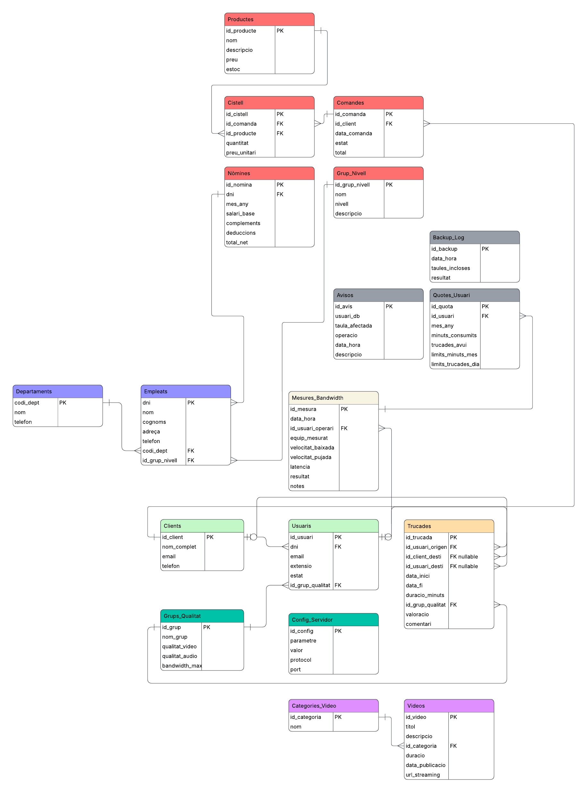

# 3. Disseny i implementació d'una base de dades

## 3.1 Justificació del SGBD escollit

S'ha escollit **MySQL 8.0** com a sistema gestor de base de dades per les següents raons:

- Suport natiu de rols a partir de la versió 8.0, necessari per implementar el control d'accés demanat.
- `GRANT FILE` funciona de forma nativa, necessari per als backups.
- Triggers, events i `SELECT INTO OUTFILE` funcionen directament sense configuració addicional.
- Disponible als repositoris oficials d'Ubuntu 24.04 sense necessitat d'instal·lació manual.
- Àmplia documentació i comunitat de suport.

---

## 3.2 Diagrama Entitat-Relació

El diagrama E/R representa les 18 entitats de la base de dades d'InnovateTech, les seves relacions i cardinalitats.


---

## 3.3 Model Relacional

A partir del diagrama E/R s'ha obtingut el següent esquema relacional. Les claus primàries estan **subratllades** i les claus foranes s'indiquen amb una fletxa `→`:

**Departaments** (<u>codi_dept</u>, nom, telefon)

**Grup_Nivell** (<u>id_grup_nivell</u>, nom, nivell, descripcio)

**Empleats** (<u>dni</u>, nom, cognoms, adreca, telefon, codi_dept→Departaments, id_grup_nivell→Grup_Nivell)

**Clients** (<u>id_client</u>, nom_complet, email, telefon)

**Grups_Qualitat** (<u>id_grup</u>, nom_grup, qualitat_video, qualitat_audio, bandwidth_max)

**Config_Servidor** (<u>id_config</u>, parametre, valor, protocol, port)

**Usuaris** (<u>id_usuari</u>, dni→Empleats, email, extensio, estat, id_grup_qualitat→Grups_Qualitat)

**Categories_Video** (<u>id_categoria</u>, nom)

**Videos** (<u>id_video</u>, titol, descripcio, id_categoria→Categories_Video, duracio, data_publicacio, url_streaming)

**Productes** (<u>id_producte</u>, nom, descripcio, preu, estoc)

**Comandes** (<u>id_comanda</u>, id_client→Clients, data_comanda, estat, total)

**Cistell** (<u>id_cistell</u>, id_comanda→Comandes, id_producte→Productes, quantitat, preu_unitari)

**Nomines** (<u>id_nomina</u>, dni→Empleats, mes_any, salari_base, complements, deduccions, total_net)

**Trucades** (<u>id_trucada</u>, id_usuari_origen→Usuaris, id_client_desti→Clients*, id_usuari_desti→Usuaris*, data_inici, data_fi, duracio_minuts, id_grup_qualitat→Grups_Qualitat, valoracio, comentari)

**Mesures_Bandwidth** (<u>id_mesura</u>, data_hora, id_usuari_operari→Usuaris, equip_mesurat, velocitat_baixada, velocitat_pujada, latencia, resultat, notes)

**Quotes_Usuari** (<u>id_quota</u>, id_usuari→Usuaris, mes_any, minuts_consumits, trucades_avui, limit_minuts_mes, limit_trucades_dia)

**Avisos** (<u>id_avis</u>, usuari_db, taula_afectada, operacio, data_hora, descripcio)

**Backup_Log** (<u>id_backup</u>, data_hora, taules_incloses, resultat)

> *Els camps marcats amb `*` són nullables, ja que una trucada pot tenir com a destí un client extern o un usuari intern, però no els dos alhora.

---

## 3.4 Creació de les taules i inserció de dades

Les taules s'han creat seguint l'ordre correcte per respectar les dependències entre claus foranes. S'han definit les restriccions adequades: `PRIMARY KEY`, `FOREIGN KEY`, `NOT NULL`, `UNIQUE` i `CHECK`.

L'ordre de creació ha estat:

1. Departaments
2. Clients
3. Grups_Qualitat
4. Config_Servidor
5. Categories_Video
6. Productes
7. Grup_Nivell
8. Empleats
9. Usuaris
10. Nomines
11. Videos
12. Comandes
13. Cistell
14. Trucades
15. Mesures_Bandwidth
16. Quotes_Usuari
17. Avisos
18. Backup_Log

La taula `Avisos` s'ha configurat amb motor **MyISAM** en lloc d'InnoDB per evitar que els registres d'auditoria es perdin quan un trigger llança un error i MySQL fa rollback de la transacció:

```sql
ALTER TABLE Avisos ENGINE = MyISAM;
```

A continuació es mostra un exemple de creació de la taula `Trucades`, la més complexa pel fet que té quatre claus foranes i dos camps nullables per al destí:

```sql
CREATE TABLE Trucades (
    id_trucada          INT             NOT NULL AUTO_INCREMENT,
    id_usuari_origen    INT             NOT NULL,
    id_client_desti     INT,
    id_usuari_desti     INT,
    data_inici          DATETIME        NOT NULL,
    data_fi             DATETIME,
    duracio_minuts      DECIMAL(10,2),
    id_grup_qualitat    INT             NOT NULL,
    valoracio           INT,
    comentari           TEXT,

    CONSTRAINT pk_trucades PRIMARY KEY (id_trucada),
    CONSTRAINT fk_trucades_origen FOREIGN KEY (id_usuari_origen)
        REFERENCES Usuaris(id_usuari),
    CONSTRAINT fk_trucades_client FOREIGN KEY (id_client_desti)
        REFERENCES Clients(id_client),
    CONSTRAINT fk_trucades_usuari_desti FOREIGN KEY (id_usuari_desti)
        REFERENCES Usuaris(id_usuari),
    CONSTRAINT fk_trucades_qualitat FOREIGN KEY (id_grup_qualitat)
        REFERENCES Grups_Qualitat(id_grup),
    CONSTRAINT chk_desti CHECK (
        id_client_desti IS NOT NULL OR id_usuari_desti IS NOT NULL
    ),
    CONSTRAINT chk_valoracio CHECK (valoracio BETWEEN 1 AND 5)
);
```

Verificació de les taules creades:

```
mysql> SHOW TABLES;
+---------------------------+
| Tables_in_innovatetech    |
+---------------------------+
| Avisos                    |
| Backup_Log                |
| Categories_Video          |
| Cistell                   |
| Clients                   |
| Comandes                  |
| Config_Servidor           |
| Departaments              |
| Empleats                  |
| Grup_Nivell               |
| Grups_Qualitat            |
| Mesures_Bandwidth         |
| Nomines                   |
| Productes                 |
| Quotes_Usuari             |
| Trucades                  |
| Usuaris                   |
| Videos                    |
+---------------------------+
18 rows in set (0.00 sec)
```

---

## 3.5 Rols i permisos

S'han creat quatre rols amb permisos diferenciats segons les necessitats de cada perfil d'usuari:

| Rol | Permisos principals | Restriccions |
|---|---|---|
| `admin` | Accés total a totes les taules | Pot gestionar altres usuaris |
| `vendes` | SELECT, INSERT, UPDATE sobre Clients, Comandes, Productes, Cistell, Trucades | No pot modificar taules de personal ni nòmines |
| `administracio` | SELECT, INSERT, UPDATE sobre Empleats, Nomines, Departaments, Grup_Nivell | No pot accedir al sistema de trucades de clients |
| `treballador` | SELECT sobre Productes, Videos, Config_Servidor. SELECT i INSERT sobre Trucades | No pot modificar taules de personal ni nòmines |

Creació dels rols i assignació de permisos:

```sql
-- Creació dels rols
CREATE ROLE 'admin';
CREATE ROLE 'vendes';
CREATE ROLE 'administracio';
CREATE ROLE 'treballador';

-- Permisos rol vendes (exemple)
GRANT SELECT, INSERT, UPDATE ON innovatetech.Clients TO 'vendes';
GRANT SELECT, INSERT, UPDATE ON innovatetech.Comandes TO 'vendes';
GRANT SELECT, INSERT, UPDATE ON innovatetech.Productes TO 'vendes';
GRANT SELECT, INSERT, UPDATE ON innovatetech.Cistell TO 'vendes';
GRANT SELECT, INSERT, UPDATE ON innovatetech.Trucades TO 'vendes';
```

Verificació dels permisos assignats:

```
mysql> SHOW GRANTS FOR 'vendes';
+-----------------------------------------------------------------------+
| Grants for vendes@%                                                   |
+-----------------------------------------------------------------------+
| GRANT USAGE ON *.* TO `vendes`@`%`                                    |
| GRANT SELECT, INSERT, UPDATE ON `innovatetech`.`Cistell` TO `vendes`  |
| GRANT SELECT, INSERT, UPDATE ON `innovatetech`.`Clients` TO `vendes`  |
| GRANT SELECT, INSERT, UPDATE ON `innovatetech`.`Comandes` TO `vendes` |
| GRANT SELECT, INSERT, UPDATE ON `innovatetech`.`Productes` TO `vendes`|
| GRANT SELECT, INSERT, UPDATE ON `innovatetech`.`Trucades` TO `vendes` |
+-----------------------------------------------------------------------+
```

---

## 3.6 Script de creació automatitzada d'usuaris

S'ha creat un script en Bash (`scriptusuaris.sh`) que automatitza la creació d'usuaris a la base de dades. L'script:

- Permet donar d'alta un o més usuaris alhora.
- Executa les sentències `CREATE USER` i `GRANT` corresponents al rol assignat.
- Genera un fitxer `usuaris_creats.sql` amb les sentències SQL resultants.
- Assigna el rol correcte a cada usuari en el moment de la creació.
- Gestiona errors: usuari ja existent, rol no vàlid.
- Assigna `GRANT FILE` per permetre operacions de backup.

Exemple d'execució i resultat:

```
$ sudo bash scriptusuaris.sh
=============================================
 CREACIÓ AUTOMATITZADA D'USUARIS - InnovateTech
=============================================

Quants usuaris vols crear? 2

--- Usuari 1 de 2 ---
Nom d'usuari: user_vendes
Contrasenya:
Host (Enter per 'localhost'):
Rols disponibles: admin vendes administracio treballador
Rol: vendes
Usuari 'user_vendes'@'localhost' creat correctament amb rol 'vendes'.

--- Usuari 2 de 2 ---
Nom d'usuari: user_administracio
Contrasenya:
Host (Enter per 'localhost'):
Rols disponibles: admin vendes administracio treballador
Rol: administracio
Usuari 'user_administracio'@'localhost' creat correctament amb rol 'administracio'.

=============================================
 Usuaris creats:  2
 Errors:          0
 Fitxer SQL:      usuaris_creats.sql
=============================================
```

Contingut del fitxer `usuaris_creats.sql` generat automàticament:

```sql
-- Usuari: user_vendes@localhost | Rol: vendes
CREATE USER 'user_vendes'@'localhost' IDENTIFIED BY '***';
GRANT 'vendes' TO 'user_vendes'@'localhost';
SET DEFAULT ROLE 'vendes' TO 'user_vendes'@'localhost';
GRANT FILE ON *.* TO 'user_vendes'@'localhost';
FLUSH PRIVILEGES;
```

---

## 3.7 Triggers i comprovacions

S'han implementat cinc triggers per garantir la seguretat i el control d'accés a la base de dades. Tots els triggers que bloquegen operacions registren prèviament l'intent a la taula `Avisos` abans de llançar l'error.

### Trigger 1 — Bloqueig d'usuaris

Impedeix que un usuari amb estat `bloquejat` pugui realitzar o rebre trucades.

```sql
CREATE TRIGGER trg_bloqueig_usuari
BEFORE INSERT ON Trucades
FOR EACH ROW
BEGIN
    DECLARE estat_origen VARCHAR(10);
    DECLARE estat_desti VARCHAR(10);

    SELECT estat INTO estat_origen
    FROM Usuaris WHERE id_usuari = NEW.id_usuari_origen;

    IF NEW.id_usuari_desti IS NOT NULL THEN
        SELECT estat INTO estat_desti
        FROM Usuaris WHERE id_usuari = NEW.id_usuari_desti;
    END IF;

    IF estat_origen = 'bloquejat' THEN
        INSERT INTO Avisos (usuari_db, taula_afectada, operacio, descripcio)
        VALUES (USER(), 'Trucades', 'INSERT',
            CONCAT('Intent de trucada bloquejat. Usuari origen bloquejat: ',
            NEW.id_usuari_origen));
        SIGNAL SQLSTATE '45000'
        SET MESSAGE_TEXT = 'ERROR: L usuari origen està bloquejat i no pot realitzar trucades.';
    END IF;

    IF NEW.id_usuari_desti IS NOT NULL AND estat_desti = 'bloquejat' THEN
        INSERT INTO Avisos (usuari_db, taula_afectada, operacio, descripcio)
        VALUES (USER(), 'Trucades', 'INSERT',
            CONCAT('Intent de trucada bloquejat. Usuari destí bloquejat: ',
            NEW.id_usuari_desti));
        SIGNAL SQLSTATE '45000'
        SET MESSAGE_TEXT = 'ERROR: L usuari destí està bloquejat i no pot rebre trucades.';
    END IF;
END
```

Comprovació — L'usuari 8 (Elena Llop) té estat `bloquejat`:

```
mysql> INSERT INTO Trucades (id_usuari_origen, id_client_desti,
    id_usuari_desti, data_inici, id_grup_qualitat)
    VALUES (8, 1, NULL, NOW(), 1);

ERROR 1644 (45000): ERROR: L usuari origen està bloquejat i no pot realitzar trucades.
```

### Trigger 2 — Control de quota de minuts mensuals

Impedeix noves trucades si l'usuari ha superat els minuts mensuals assignats al seu grup.

```sql
CREATE TRIGGER trg_control_minuts
BEFORE INSERT ON Trucades
FOR EACH ROW
BEGIN
    DECLARE v_minuts_actuals DECIMAL(10,2);
    DECLARE v_limit_minuts INT;

    SELECT minuts_consumits, limit_minuts_mes
    INTO v_minuts_actuals, v_limit_minuts
    FROM Quotes_Usuari
    WHERE id_usuari = NEW.id_usuari_origen
    AND mes_any = DATE_FORMAT(NOW(), '%Y-%m');

    IF v_minuts_actuals IS NOT NULL AND (v_minuts_actuals >= v_limit_minuts) THEN
        INSERT INTO Avisos (usuari_db, taula_afectada, operacio, descripcio)
        VALUES (USER(), 'Trucades', 'INSERT',
            CONCAT('Quota de minuts mensuals superada per usuari id: ',
            NEW.id_usuari_origen));
        SIGNAL SQLSTATE '45000'
        SET MESSAGE_TEXT = 'ERROR: Has superat la quota de minuts mensuals.';
    END IF;
END
```

Comprovació:

```
mysql> UPDATE Quotes_Usuari SET minuts_consumits = 500
    WHERE id_usuari = 1 AND mes_any = '2026-05';

mysql> INSERT INTO Trucades (id_usuari_origen, id_client_desti,
    id_usuari_desti, data_inici, id_grup_qualitat)
    VALUES (1, 1, NULL, NOW(), 1);

ERROR 1644 (45000): ERROR: Has superat la quota de minuts mensuals.
```

### Trigger 3 — Control de trucades diàries

Impedeix noves trucades si l'usuari ha superat el nombre màxim de trucades diàries.

```sql
CREATE TRIGGER trg_control_trucades_dia
BEFORE INSERT ON Trucades
FOR EACH ROW
BEGIN
    DECLARE v_trucades_avui INT;
    DECLARE v_limit_trucades INT;

    SELECT trucades_avui, limit_trucades_dia
    INTO v_trucades_avui, v_limit_trucades
    FROM Quotes_Usuari
    WHERE id_usuari = NEW.id_usuari_origen
    AND mes_any = DATE_FORMAT(NOW(), '%Y-%m');

    IF v_trucades_avui IS NOT NULL AND (v_trucades_avui >= v_limit_trucades) THEN
        INSERT INTO Avisos (usuari_db, taula_afectada, operacio, descripcio)
        VALUES (USER(), 'Trucades', 'INSERT',
            CONCAT('Quota de trucades diàries superada per usuari id: ',
            NEW.id_usuari_origen));
        SIGNAL SQLSTATE '45000'
        SET MESSAGE_TEXT = 'ERROR: Has superat el nombre màxim de trucades diàries.';
    END IF;
END
```

Comprovació:

```
mysql> UPDATE Quotes_Usuari SET trucades_avui = 10
    WHERE id_usuari = 1 AND mes_any = '2026-05';

mysql> INSERT INTO Trucades (id_usuari_origen, id_client_desti,
    id_usuari_desti, data_inici, id_grup_qualitat)
    VALUES (1, 1, NULL, NOW(), 1);

ERROR 1644 (45000): ERROR: Has superat el nombre màxim de trucades diàries.
```

### Trigger 4 — Auditoria d'accés a Nomines

Registra i bloqueja qualsevol intent de modificació de la taula `Nomines` per part d'usuaris amb rol `vendes` o `treballador`. El trigger s'identifica per nom d'usuari de MySQL mitjançant la funció `USER()`.

```sql
CREATE TRIGGER trg_audit_nomines
BEFORE UPDATE ON Nomines
FOR EACH ROW
BEGIN
    IF USER() LIKE '%vendes%' OR USER() LIKE '%treballador%' THEN
        INSERT INTO Avisos (usuari_db, taula_afectada, operacio, descripcio)
        VALUES (USER(), 'Nomines', 'UPDATE',
            CONCAT('Intent no autoritzat de modificar taula Nomines: ', USER()));
        SIGNAL SQLSTATE '45000'
        SET MESSAGE_TEXT = 'ERROR: No tens permisos per modificar la taula Nomines.';
    END IF;
END
```

Comprovació — connectats amb l'usuari `test_vendes`:

```
mysql> UPDATE Nomines SET salari_base = 9999 WHERE dni = '12345678A';
ERROR 1644 (45000): ERROR: No tens permisos per modificar la taula Nomines.
```

### Trigger 5 — Auditoria d'accés a Trucades

Registra i bloqueja qualsevol intent d'accés a la taula `Trucades` per part d'usuaris amb rol `administracio`.

```sql
CREATE TRIGGER trg_audit_trucades
BEFORE INSERT ON Trucades
FOR EACH ROW
BEGIN
    IF USER() LIKE '%administracio%' THEN
        INSERT INTO Avisos (usuari_db, taula_afectada, operacio, descripcio)
        VALUES (USER(), 'Trucades', 'INSERT',
            CONCAT('Intent no autoritzat d accés a Trucades: ', USER()));
        SIGNAL SQLSTATE '45000'
        SET MESSAGE_TEXT = 'ERROR: No tens permisos per accedir a les trucades de clients.';
    END IF;
END
```

Comprovació — connectats amb l'usuari `test_administracio`:

```
mysql> INSERT INTO Trucades (id_usuari_origen, id_client_desti,
    id_usuari_desti, data_inici, id_grup_qualitat)
    VALUES (1, 1, NULL, NOW(), 1);

ERROR 1644 (45000): ERROR: No tens permisos per accedir a les trucades de clients.
```

---

## 3.8 Backup

S'ha creat un event periòdic (`evt_backup_diari`) que s'executa automàticament cada dia a les **02:00 AM**. S'ha escollit aquesta hora perquè és el moment de menor activitat del sistema, minimitzant l'impacte en el rendiment.

L'event realitza còpies de seguretat de les quatre taules crítiques en format CSV al directori `/var/lib/mysql/backup/`:

| Taula | Fitxer generat |
|---|---|
| Empleats | `empleats.csv` |
| Clients | `clients.csv` |
| Trucades | `trucades.csv` |
| Mesures_Bandwidth | `mesures_bandwidth.csv` |

Cada execució queda registrada automàticament a la taula `Backup_Log` amb la data, les taules incloses i el resultat.

```sql
CREATE EVENT evt_backup_diari
ON SCHEDULE EVERY 1 DAY
STARTS '2025-05-21 02:00:00'
DO
BEGIN
    SELECT * INTO OUTFILE '/var/lib/mysql/backup/empleats.csv'
    FIELDS TERMINATED BY ',' ENCLOSED BY '"'
    LINES TERMINATED BY '\n'
    FROM Empleats;

    SELECT * INTO OUTFILE '/var/lib/mysql/backup/clients.csv'
    FIELDS TERMINATED BY ',' ENCLOSED BY '"'
    LINES TERMINATED BY '\n'
    FROM Clients;

    SELECT * INTO OUTFILE '/var/lib/mysql/backup/trucades.csv'
    FIELDS TERMINATED BY ',' ENCLOSED BY '"'
    LINES TERMINATED BY '\n'
    FROM Trucades;

    SELECT * INTO OUTFILE '/var/lib/mysql/backup/mesures_bandwidth.csv'
    FIELDS TERMINATED BY ',' ENCLOSED BY '"'
    LINES TERMINATED BY '\n'
    FROM Mesures_Bandwidth;

    INSERT INTO Backup_Log (taules_incloses, resultat)
    VALUES ('Empleats, Clients, Trucades, Mesures_Bandwidth', 'correcte');
END
```

Verificació de l'event:

```
mysql> SHOW EVENTS;
+--------------+------------------+----------------+-----------+-----------+
| Db           | Name             | Definer        | Type      | Status    |
+--------------+------------------+----------------+-----------+-----------+
| innovatetech | evt_backup_diari | root@localhost | RECURRING | ENABLED   |
+--------------+------------------+----------------+-----------+-----------+
```
