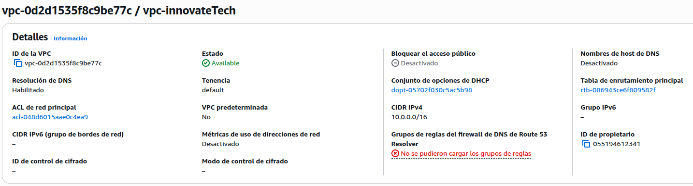
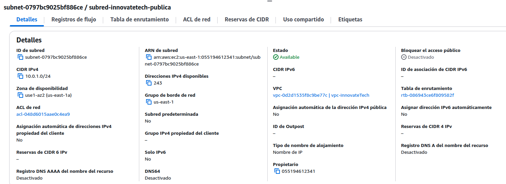
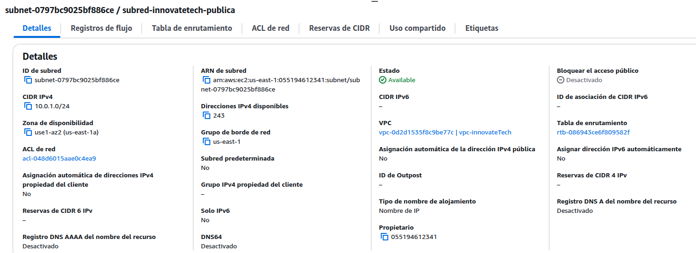
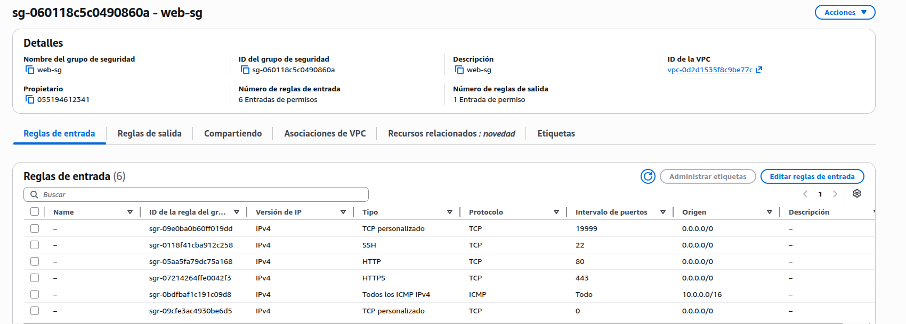
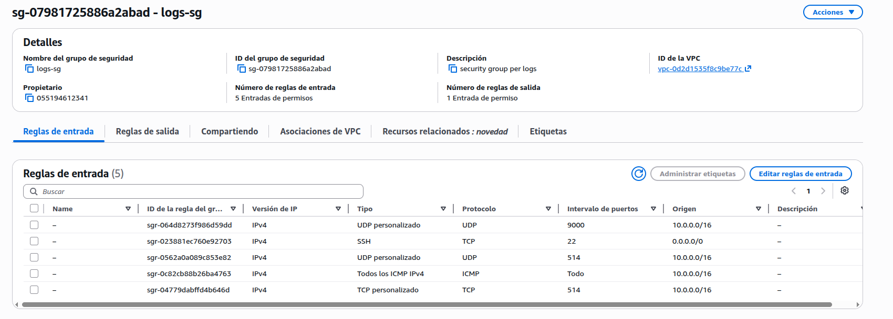
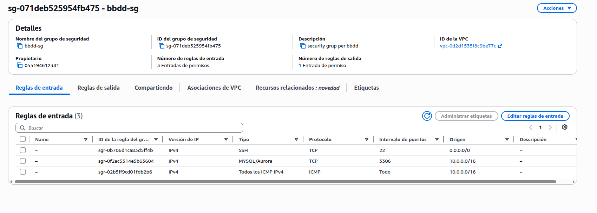
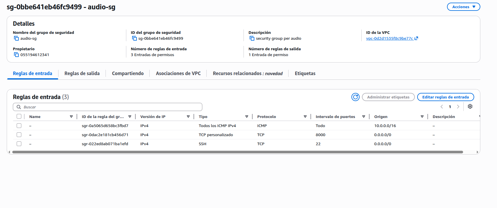
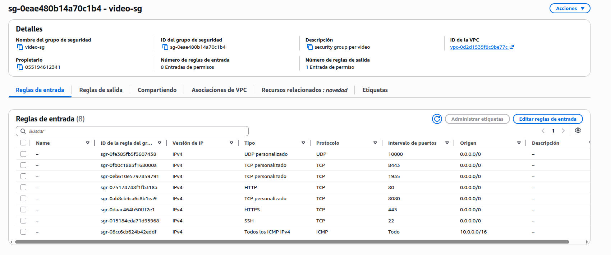
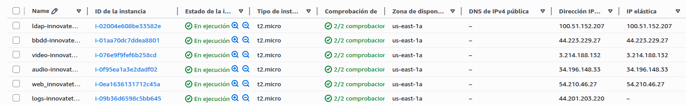

# 2. Infraestructura AWS

**Projecte:** Projecte Transversal ASIXc1 — InnovateTech  
**Autors:** Joel Baena, Marc Balastegui, Oussama Boukhali, Alex Sampietro 
**Data:** Maig 2026  
**Regió:** us-east-1 (N. Virginia)

---

<a name="index"></a>
## Índex

- [2.1 Gestió de crèdits](#21-gestió-de-crèdits)
- [2.2 Visió general de l'arquitectura](#22-visió-general-de-larquitectura)
- [2.3 Decisions de disseny](#23-decisions-de-disseny)
- [2.4 Crear la VPC](#24-crear-la-vpc)
- [2.5 Crear la subxarxa](#25-crear-la-subxarxa)
- [2.6 Crear l'Internet Gateway](#26-crear-linternet-gateway)
- [2.7 Configurar la taula de rutes](#27-configurar-la-taula-de-rutes)
- [2.8 Crear els Security Groups](#28-crear-els-security-groups)
- [2.9 Par de claus](#29-par-de-claus)
- [2.10 Crear les instàncies EC2](#210-crear-les-instàncies-ec2)
- [2.11 IPs elàstiques](#211-ips-elàstiques)
- [2.12 Crear usuari específic a cada màquina](#212-crear-usuari-específic-a-cada-màquina)
- [2.13 Aturar i engegar les instàncies](#213-aturar-i-engegar-les-instàncies)
- [2.14 Referència de connexions](#214-referència-de-connexions)
- [2.15 Resum final](#215-resum-final)

---

## 2.1 Gestió de crèdits

Disposem de 50 crèdits AWS. Per no gastar-los innecessàriament seguim aquestes regles:

- Aturar totes les instàncies al final de cada sessió de treball
- No deixar les instàncies engegades durant la nit ni caps de setmana
- Les IPs elàstiques han d'estar sempre associades a una instància en funcionament
- No crear NAT Gateway — no és necessari per a aquesta arquitectura

| Escenari | Cost aproximat |
|----------|---------------|
| 6 instàncies t2.micro engegades | ~$0.07/hora (~$1.68/dia) |
| Instàncies aturades | ~$0.05/dia |
| IP elàstica associada a instància engegada | $0.00 |
| IP elàstica no associada | ~$0.005/hora |

[↑ Tornar a l'índex](#index)

---

## 2.2 Visió general de l'arquitectura

| Component | Nom | ID | Tipus | Propòsit |
|-----------|-----|----|-------|---------|
| Xarxa virtual | `vpc-innovateTech` | `vpc-0d2d1535f8c9be77c` | VPC | Xarxa privada aïllada |
| Subxarxa | `subred-innovateTech-publica` | `subnet-0797bc9025bf886ce` | Subnet `10.0.1.0/24` | Allotja totes les instàncies |
| Internet Gateway | — | `igw-0f82018c365851c01` | Gateway | Connectivitat a internet |
| Taula de rutes | — | `rtb-086943ce6f809582f` | Route Table | Ruta `0.0.0.0/0 → igw` |
| LDAP | `ldap-innovatetech` | `i-02004e608be33582e` | EC2 t2.micro | Directori actiu |
| Web + SFTP | `web-innovatetech` | `i-0ea1636131712c45a` | EC2 t2.micro | Servidor web + SFTP |
| Logs | `logs-innovatetech` | `i-09b36d6598c5bb645` | EC2 t2.micro | Centralització logs |
| BBDD | `bbdd-innovatetech` | `i-01aa70dc7ddea8801` | EC2 t2.micro | Base de dades MySQL |
| Àudio | `audio-innovatetech` | `i-0f95ea1a3e2dadf02` | EC2 t2.micro | Streaming àudio |
| Vídeo | `video-innovatetech` | `i-076e9f9fef6b258cd` | EC2 t2.micro | Streaming vídeo + Jitsi |
| Firewall LDAP | `ldap-sg` | `sg-0b8f69e580117a15e` | Security Group | Ports 22, 80, 389, 636, ICMP |
| Firewall Web | `web-sg` | `sg-060118c5c0490860a` | Security Group | Ports 22, 80, 443, 19999, ICMP |
| Firewall Logs | `logs-sg` | `sg-07981725886a2abad` | Security Group | Ports 22, 514, 9000, ICMP |
| Firewall BBDD | `bbdd-sg` | `sg-071deb525954fb475` | Security Group | Ports 22, 3306, ICMP |
| Firewall Àudio | `audio-sg` | `sg-0bbe641eb46fc9499` | Security Group | Ports 22, 8000, ICMP |
| Firewall Vídeo | `video-sg` | `sg-0eae480b14a70c1b4` | Security Group | Ports 22, 80, 443, 1935, 8080, 8443, 10000, ICMP |
| Clau SSH | `vockey` | — | Key Pair | Accés administratiu |

[↑ Tornar a l'índex](#index)

---

## 2.3 Decisions de disseny

- Totes les màquines estan a la mateixa subxarxa pública per simplicitat i per evitar costos de NAT Gateway
- S'utilitza t2.micro per a totes les màquines per minimitzar el cost de crèdits
- Cada servei té el seu propi Security Group per limitar els ports oberts al mínim necessari
- Les màquines s'administren amb un usuari específic per màquina i autenticació per clau pública/privada sense contrasenya
- S'han assignat IPs elàstiques a 5 màquines per tenir IPs fixes — la màquina de logs té IP dinàmica

[↑ Tornar a l'índex](#index)

---

## 2.4 Crear la VPC

1. Obre la consola AWS → cerca **VPC** → obre el VPC Dashboard
2. Clica **"Create VPC"** → selecciona **"VPC only"**
3. Configura:

| Camp | Valor |
|------|-------|
| Name tag | `vpc-innovateTech` |
| IPv4 CIDR block | `10.0.0.0/16` |
| IPv6 CIDR block | No IPv6 |
| Tenancy | Default |

4. Clica **"Create VPC"**

> **Resultat:** `vpc-0d2d1535f8c9be77c`

> 

[↑ Tornar a l'índex](#index)

---

## 2.5 Crear la subxarxa

1. VPC → **Subnets** → **"Create subnet"**
2. Selecciona VPC: `vpc-innovateTech`
3. Configura:

| Camp | Valor |
|------|-------|
| Subnet name | `subred-innovateTech-publica` |
| Availability Zone | `us-east-1a` |
| IPv4 CIDR block | `10.0.1.0/24` |

4. Clica **"Create subnet"**

> **Resultat:** `subnet-0797bc9025bf886ce`

> 

[↑ Tornar a l'índex](#index)

---

## 2.6 Crear l'Internet Gateway

1. VPC → **Internet Gateways** → **"Create internet gateway"**
2. Clica **"Create internet gateway"**
3. Clica **"Actions"** → **"Attach to VPC"** → selecciona `vpc-innovateTech`

> **Resultat:** `igw-0f82018c365851c01`

[↑ Tornar a l'índex](#index)

---

## 2.7 Configurar la taula de rutes

1. VPC → **Route Tables** → selecciona `rtb-086943ce6f809582f`
2. Pestanya **"Routes"** → **"Edit routes"** → **"Add route"**:

| Destí | Target |
|-------|--------|
| `0.0.0.0/0` | `igw-0f82018c365851c01` |
| `10.0.0.0/16` | local |

3. Pestanya **"Subnet associations"** → associa `subred-innovateTech-publica`

> 

[↑ Tornar a l'índex](#index)

---

## 2.8 Crear els Security Groups

### 2.8.1 ldap-sg

| Camp | Valor |
|------|-------|
| Nom | `ldap-sg` |
| ID | `sg-0b8f69e580117a15e` |
| Descripció | security group per ldap |

| Tipus | Protocol | Port | Origen |
|-------|---------|------|--------|
| SSH | TCP | 22 | `0.0.0.0/0` |
| LDAP | TCP | 389 | `10.0.0.0/16` |
| TCP personalitzat | TCP | 636 | `10.0.0.0/16` |
| HTTP | TCP | 80 | `0.0.0.0/0` |
| ICMP | ICMP | Tot | `10.0.0.0/16` |

> 

### 2.8.2 web-sg

| Camp | Valor |
|------|-------|
| Nom | `web-sg` |
| ID | `sg-060118c5c0490860a` |
| Descripció | web-sg |

| Tipus | Protocol | Port | Origen |
|-------|---------|------|--------|
| SSH | TCP | 22 | `0.0.0.0/0` |
| HTTP | TCP | 80 | `0.0.0.0/0` |
| HTTPS | TCP | 443 | `0.0.0.0/0` |
| TCP personalitzat | TCP | 19999 | `0.0.0.0/0` |
| TCP personalitzat | TCP | 0 | `0.0.0.0/0` |
| ICMP | ICMP | Tot | `10.0.0.0/16` |

> 

### 2.8.3 logs-sg

| Camp | Valor |
|------|-------|
| Nom | `logs-sg` |
| ID | `sg-07981725886a2abad` |
| Descripció | security group per logs |

| Tipus | Protocol | Port | Origen |
|-------|---------|------|--------|
| SSH | TCP | 22 | `0.0.0.0/0` |
| UDP personalitzat | UDP | 514 | `10.0.0.0/16` |
| TCP personalitzat | TCP | 514 | `10.0.0.0/16` |
| UDP personalitzat | UDP | 9000 | `10.0.0.0/16` |
| ICMP | ICMP | Tot | `10.0.0.0/16` |

> 

### 2.8.4 bbdd-sg

| Camp | Valor |
|------|-------|
| Nom | `bbdd-sg` |
| ID | `sg-071deb525954fb475` |
| Descripció | security grup per bbdd |

| Tipus | Protocol | Port | Origen |
|-------|---------|------|--------|
| SSH | TCP | 22 | `0.0.0.0/0` |
| MySQL/Aurora | TCP | 3306 | `10.0.0.0/16` |
| ICMP | ICMP | Tot | `10.0.0.0/16` |

> 

### 2.8.5 audio-sg

| Camp | Valor |
|------|-------|
| Nom | `audio-sg` |
| ID | `sg-0bbe641eb46fc9499` |
| Descripció | security group per audio |

| Tipus | Protocol | Port | Origen |
|-------|---------|------|--------|
| SSH | TCP | 22 | `0.0.0.0/0` |
| TCP personalitzat | TCP | 8000 | `0.0.0.0/0` |
| ICMP | ICMP | Tot | `10.0.0.0/16` |

> 

### 2.8.6 video-sg

| Camp | Valor |
|------|-------|
| Nom | `video-sg` |
| ID | `sg-0eae480b14a70c1b4` |
| Descripció | security group per video |

| Tipus | Protocol | Port | Origen |
|-------|---------|------|--------|
| SSH | TCP | 22 | `0.0.0.0/0` |
| HTTP | TCP | 80 | `0.0.0.0/0` |
| HTTPS | TCP | 443 | `0.0.0.0/0` |
| TCP personalitzat | TCP | 1935 | `0.0.0.0/0` |
| TCP personalitzat | TCP | 8080 | `0.0.0.0/0` |
| TCP personalitzat | TCP | 8443 | `0.0.0.0/0` |
| UDP personalitzat | UDP | 10000 | `0.0.0.0/0` |
| ICMP | ICMP | Tot | `10.0.0.0/16` |

> 

[↑ Tornar a l'índex](#index)

---

## 2.9 Par de claus

S'utilitza el `vockey` de AWS Academy. El fitxer `labsuser.pem` es descarrega des de **AWS Academy → AWS Details → SSH Key**.

```bash
chmod 400 labsuser.pem
```

[↑ Tornar a l'índex](#index)

---

## 2.10 Crear les instàncies EC2

Per a cada instància: **EC2 → Instances → "Launch instances"**

A **"Advanced network configuration"** s'ha posat la IP privada fixa de cada màquina.

### 2.10.1 ldap-innovatetech

| Camp | Valor |
|------|-------|
| Nom | `ldap-innovatetech` |
| ID | `i-02004e608be33582e` |
| AMI | Ubuntu Server 24.04 LTS (HVM) |
| Arquitectura | 64-bit (x86) |
| Tipus | t2.micro |
| Clau | vockey |
| VPC | `vpc-innovateTech` |
| Subxarxa | `subred-innovateTech-publica` |
| Security Group | `ldap-sg` |
| IP privada | `10.0.1.10` |
| Emmagatzematge | 8 GB gp2 |

### 2.10.2 web-innovatetech

| Camp | Valor |
|------|-------|
| Nom | `web-innovatetech` |
| ID | `i-0ea1636131712c45a` |
| AMI | Ubuntu Server 24.04 LTS (HVM) |
| Arquitectura | 64-bit (x86) |
| Tipus | t2.micro |
| Clau | vockey |
| VPC | `vpc-innovateTech` |
| Subxarxa | `subred-innovateTech-publica` |
| Security Group | `web-sg` |
| IP privada | `10.0.1.21` |
| Emmagatzematge | 8 GB gp2 |

### 2.10.3 logs-innovatetech

| Camp | Valor |
|------|-------|
| Nom | `logs-innovatetech` |
| ID | `i-09b36d6598c5bb645` |
| AMI | Ubuntu Server 24.04 LTS (HVM) |
| Arquitectura | 64-bit (x86) |
| Tipus | t2.micro |
| Clau | vockey |
| VPC | `vpc-innovateTech` |
| Subxarxa | `subred-innovateTech-publica` |
| Security Group | `logs-sg` |
| IP privada | `10.0.1.31` |
| Emmagatzematge | 8 GB gp2 |

### 2.10.4 bbdd-innovatetech

| Camp | Valor |
|------|-------|
| Nom | `bbdd-innovatetech` |
| ID | `i-01aa70dc7ddea8801` |
| AMI | Ubuntu Server 24.04 LTS (HVM) |
| Arquitectura | 64-bit (x86) |
| Tipus | t2.micro |
| Clau | vockey |
| VPC | `vpc-innovateTech` |
| Subxarxa | `subred-innovateTech-publica` |
| Security Group | `bbdd-sg` |
| IP privada | `10.0.1.40` |
| Emmagatzematge | 8 GB gp2 |

### 2.10.5 audio-innovatetech

| Camp | Valor |
|------|-------|
| Nom | `audio-innovatetech` |
| ID | `i-0f95ea1a3e2dadf02` |
| AMI | Ubuntu Server 24.04 LTS (HVM) |
| Arquitectura | 64-bit (x86) |
| Tipus | t2.micro |
| Clau | vockey |
| VPC | `vpc-innovateTech` |
| Subxarxa | `subred-innovateTech-publica` |
| Security Group | `audio-sg` |
| IP privada | `10.0.1.50` |
| Emmagatzematge | 8 GB gp2 |

### 2.10.6 video-innovatetech

| Camp | Valor |
|------|-------|
| Nom | `video-innovatetech` |
| ID | `i-076e9f9fef6b258cd` |
| AMI | Ubuntu Server 24.04 LTS (HVM) |
| Arquitectura | 64-bit (x86) |
| Tipus | t2.micro |
| Clau | vockey |
| VPC | `vpc-innovateTech` |
| Subxarxa | `subred-innovateTech-publica` |
| Security Group | `video-sg` |
| IP privada | `10.0.1.60` |
| Emmagatzematge | 8 GB gp2 |

> 

[↑ Tornar a l'índex](#index)

---

## 2.11 IPs elàstiques

S'han assignat IPs elàstiques a 5 màquines per tenir IPs fixes que no canviïn quan s'atura la instància:

| Instància | IP privada | IP elàstica |
|-----------|-----------|-------------|
| `ldap-innovatetech` | `10.0.1.10` | `100.51.152.207` |
| `web-innovatetech` | `10.0.1.21` | `54.210.46.27` |
| `bbdd-innovatetech` | `10.0.1.40` | `44.223.229.27` |
| `audio-innovatetech` | `10.0.1.50` | `34.196.148.33` |
| `video-innovatetech` | `10.0.1.60` | `3.214.188.132` |
| `logs-innovatetech` | `10.0.1.31` | — (IP dinàmica) |

[↑ Tornar a l'índex](#index)

---

## 2.12 Crear usuari específic a cada màquina

Un cop creada cada instància, cal crear un usuari específic i configurar l'accés per clau pública. L'enunciat prohibeix usar l'usuari per defecte `ubuntu`.

```bash
# Connectar-se amb ubuntu per defecte
ssh -i labsuser.pem ubuntu@IP_PUBLICA

# Crear usuari específic (exemple per a LDAP)
sudo adduser admintech_ldap
sudo usermod -aG sudo admintech_ldap
sudo mkdir -p /home/admintech_ldap/.ssh
sudo chmod 700 /home/admintech_ldap/.ssh
sudo cp /home/ubuntu/.ssh/authorized_keys /home/admintech_ldap/.ssh/
sudo chmod 600 /home/admintech_ldap/.ssh/authorized_keys
sudo chown -R admintech_ldap:admintech_ldap /home/admintech_ldap/.ssh
```

| Màquina | Usuari específic |
|---------|----------------|
| `ldap-innovatetech` | `admintech_ldap` |
| `web-innovatetech` | `admintech_web` |
| `logs-innovatetech` | `admintech_logs` |
| `bbdd-innovatetech` | `admintech` |
| `audio-innovatetech` | `admintech_audio` |
| `video-innovatetech` | `admintech_video` |

[↑ Tornar a l'índex](#index)

---

## 2.13 Aturar i engegar les instàncies

### Al final de cada sessió

1. EC2 → Instances
2. Selecciona totes les instàncies
3. **"Instance state"** → **"Stop instance"** → confirma

### A l'inici de cada sessió

1. Selecciona totes les instàncies
2. **"Instance state"** → **"Start instance"**
3. Espera que l'estat sigui **"Running"** amb **2/2 status checks**

> Les màquines amb IP elàstica mantenen la mateixa IP. La màquina de logs canvia la IP pública cada vegada que s'engega.

[↑ Tornar a l'índex](#index)

---

## 2.14 Referència de connexions

```bash
# LDAP
ssh -i labsuser.pem admintech_ldap@100.51.152.207

# Web + SFTP
ssh -i labsuser.pem admintech_web@54.210.46.27

# Logs (IP dinàmica — comprovar a AWS cada sessió)
ssh -i labsuser.pem admintech_logs@IP_PUBLICA_LOGS

# BBDD
ssh -i labsuser.pem admintech@44.223.229.27

# Àudio
ssh -i labsuser.pem admintech_audio@34.196.148.33

# Vídeo
ssh -i labsuser.pem admintech_video@3.214.188.132
```

[↑ Tornar a l'índex](#index)

---

## 2.15 Resum final

| Component | Detalls |
|-----------|---------|
| VPC | `vpc-innovateTech` — `vpc-0d2d1535f8c9be77c` — CIDR `10.0.0.0/16` |
| Subxarxa | `subred-innovateTech-publica` — `10.0.1.0/24` — `us-east-1a` |
| Internet Gateway | `igw-0f82018c365851c01` — associat a la VPC |
| Taula de rutes | `rtb-086943ce6f809582f` — `0.0.0.0/0 → igw` |
| EC2 LDAP | `ldap-innovatetech` — t2.micro — `10.0.1.10` — `100.51.152.207` |
| EC2 Web | `web-innovatetech` — t2.micro — `10.0.1.21` — `54.210.46.27` |
| EC2 Logs | `logs-innovatetech` — t2.micro — `10.0.1.31` — IP dinàmica |
| EC2 BBDD | `bbdd-innovatetech` — t2.micro — `10.0.1.40` — `44.223.229.27` |
| EC2 Àudio | `audio-innovatetech` — t2.micro — `10.0.1.50` — `34.196.148.33` |
| EC2 Vídeo | `video-innovatetech` — t2.micro — `10.0.1.60` — `3.214.188.132` |
| Accés SSH | Clau `labsuser.pem` + usuari específic per màquina sense contrasenya |
| Ansible | Web i Logs configurades completament amb Ansible |

[↑ Tornar a l'índex](#index)
