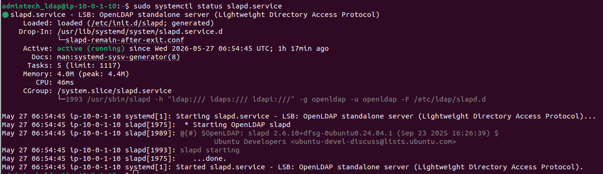
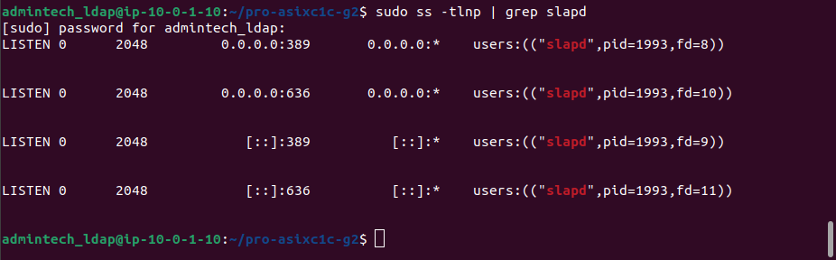
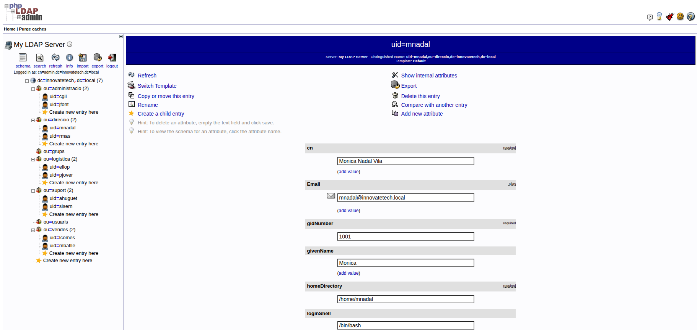
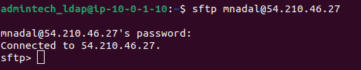

# 3. Servei LDAP

**Servidor:** `ldap-innovatetech` — `10.0.1.10`  
**IP elàstica:** `100.51.152.207`  
**Software:** OpenLDAP (slapd)  
**Domini:** `innovatetech.local`  
**Base DN:** `dc=innovatetech,dc=local`

---

<a name="index"></a>
## Índex

- [3.1 Descripció del servei](#31-descripció-del-servei)
- [3.2 Instal·lació](#32-installació)
- [3.3 Configuració del domini](#33-configuració-del-domini)
- [3.4 Unitats Organitzatives (OUs)](#34-unitats-organitzatives-ous)
- [3.5 Usuaris](#35-usuaris)
- [3.6 phpLDAPadmin](#36-phpldapadmin)
- [3.7 Integració amb SFTP](#37-integració-amb-sftp)
- [3.8 Verificació del servei](#38-verificació-del-servei)

---

## 3.1 Descripció del servei

El servei LDAP (Lightweight Directory Access Protocol) actua com a directori actiu centralitzat d'InnovateTech. Emmagatzema tots els usuaris de l'empresa organitzats per departaments i permet que altres serveis (SFTP, web) autentiquin els usuaris contra aquest directori sense necessitat de gestionar usuaris localment a cada servidor.

[↑ Tornar a l'índex](#index)

---

## 3.2 Instal·lació

Actualitzar el sistema i instal·lar OpenLDAP:

```bash
sudo apt update && sudo apt upgrade -y
sudo apt install slapd ldap-utils -y
```

Durant la instal·lació es demana una contrasenya d'administrador. Es pot deixar en blanc perquè es configurarà al pas següent.

[↑ Tornar a l'índex](#index)

---

## 3.3 Configuració del domini

Reconfigurar slapd per definir el domini i l'organització:

```bash
sudo dpkg-reconfigure slapd
```

Respostes a les preguntes:

| Pregunta | Resposta |
|----------|---------|
| Omit OpenLDAP server configuration? | No |
| DNS domain name | `innovatetech.local` |
| Organization name | `InnovateTech` |
| Administrator password | `****` |
| Do you want the database removed when slapd is purged? | No |
| Move old database? | Yes |

Verificar que el servei funciona:

```bash
sudo systemctl status slapd
sudo systemctl enable slapd
```

> 

Verificar els ports actius (389 i 636):

```bash
sudo ss -tlnp | grep slapd
```

> 

Verificar l'estructura base:

```bash
sudo ldapsearch -x -LLL -H ldap:// -b "dc=innovatetech,dc=local"
```

[↑ Tornar a l'índex](#index)

---

## 3.4 Unitats Organitzatives (OUs)

Es creen 7 OUs per organitzar els usuaris per departament.

Vegeu el fitxer complet: [ous_innova.ldif](../scripts/ldap/ous_innova.ldif)

| OU | Departament |
|----|------------|
| `ou=usuaris` | Usuaris generals |
| `ou=grups` | Grups |
| `ou=vendes` | Vendes |
| `ou=suport` | Suport Tècnic |
| `ou=administracio` | Administració |
| `ou=logistica` | Logística |
| `ou=direccio` | Direcció |

Aplicar les OUs al servidor:

```bash
sudo ldapadd -x -D "cn=admin,dc=innovatetech,dc=local" -W -f ~/ous_innova.ldif
```

[↑ Tornar a l'índex](#index)

---

## 3.5 Usuaris

Es creen 10 usuaris corresponents als empleats d'InnovateTech.

Vegeu el fitxer complet: [usuaris_innova.ldif](../scripts/ldap/usuaris_innova.ldif)

| UID | Nom complet | Departament | UID Number |
|-----|------------|------------|-----------|
| `mnadal` | Mònica Nadal Vila | Direcció | 1001 |
| `mbatlle` | Marc Batlle Soler | Vendes | 1002 |
| `lcomes` | Laura Comes Puig | Vendes | 1003 |
| `jfont` | Jordi Font Mas | Administració | 1004 |
| `cgil` | Cristina Gil Valls | Administració | 1005 |
| `ahuguet` | Antoni Huguet Roca | Suport | 1006 |
| `sisern` | Silvia Isern Tort | Suport | 1007 |
| `pjover` | Pau Jover Bosch | Logística | 1008 |
| `ellop` | Elena Llop Puig | Logística | 1009 |
| `rmas` | Ramon Mas Riera | Direcció | 1010 |

Aplicar els usuaris:

```bash
sudo ldapadd -x -D "cn=admin,dc=innovatetech,dc=local" -W -f ~/usuaris_innova.ldif
```

Verificar que els usuaris s'han creat:

```bash
sudo ldapsearch -x -LLL -H ldap:// -b "dc=innovatetech,dc=local" "(objectClass=inetOrgPerson)"
```

[↑ Tornar a l'índex](#index)

---

## 3.6 phpLDAPadmin

phpLDAPadmin és una interfície web per gestionar el LDAP visualment des del navegador.

### Instal·lació

```bash
sudo apt install phpldapadmin -y
```

### Configuració

```bash
sudo nano /etc/phpldapadmin/config.php
```

Modificar aquestes línies:

```php
$servers->setValue('server','base',array('dc=innovatetech,dc=local'));
$servers->setValue('login','bind_id','cn=admin,dc=innovatetech,dc=local');
```

Reiniciar Apache:

```bash
sudo systemctl restart apache2
```

### Accés

```
http://100.51.152.207/phpldapadmin
```

- **Login DN:** `cn=admin,dc=innovatetech,dc=local`

> 

[↑ Tornar a l'índex](#index)

---

## 3.7 Integració amb SFTP

Els usuaris del LDAP s'autentiquen al servei SFTP de la màquina web (`10.0.1.21`). Això es configura a la màquina web instal·lant `libpam-ldapd` i `libnss-ldapd` apuntant a `ldap://10.0.1.10`.

Vegeu la configuració completa a [4-WEB-SFTP.md](4-WEB-SFTP.md)

Prova de connexió SFTP amb un usuari LDAP:

```bash
sftp mnadal@54.210.46.27
```

Si la connexió és correcta apareix:
```
sftp>
```

> 

[↑ Tornar a l'índex](#index)

---

## 3.8 Verificació del servei

```bash
# Estat del servei
sudo systemctl status slapd

# Ports actius (389 i 636)
sudo ss -tlnp | grep slapd

# Llistat de tots els usuaris
sudo ldapsearch -x -LLL -H ldap:// -b "dc=innovatetech,dc=local" "(objectClass=inetOrgPerson)"
```

[↑ Tornar a l'índex](#index)
