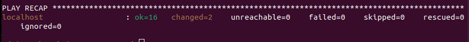
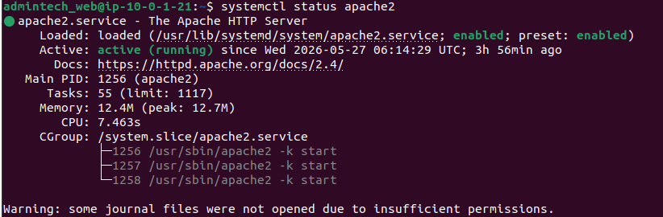
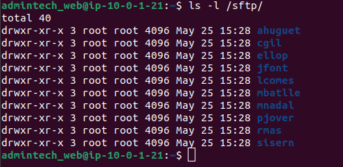
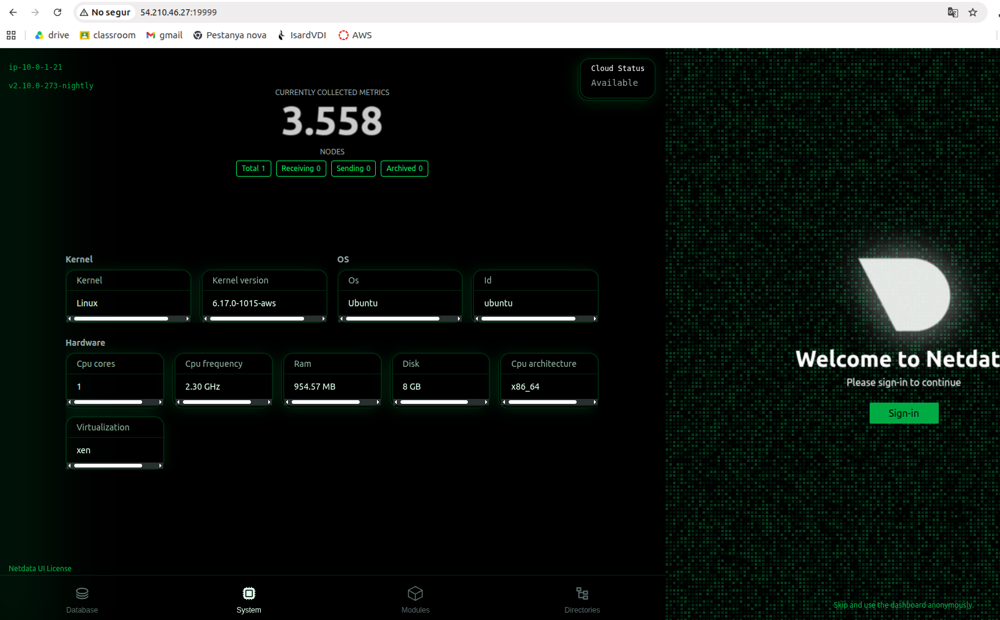

# 4. Servei Web + SFTP

**Servidor:** `web-innovatetech` — `10.0.1.21`  
**IP elàstica:** `54.210.46.27`  
**Software:** Apache2 + OpenSSH (SFTP) + Netdata  
**Configurat amb:** Ansible

---

<a name="index"></a>
## Índex

- [4.1 Descripció del servei](#41-descripció-del-servei)
- [4.2 Ansible](#42-ansible)
- [4.3 Servei web (Apache)](#43-servei-web-apache)
- [4.4 Servei SFTP](#44-servei-sftp)
- [4.5 Integració LDAP](#45-integració-ldap)
- [4.6 Netdata](#46-netdata)
- [4.7 Verificació del servei](#47-verificació-del-servei)

---

## 4.1 Descripció del servei

La màquina web allotja dos serveis principals:

- **Apache2** — servidor web amb la pàgina corporativa d'InnovateTech, accessible des d'internet
- **SFTP** — servei de transferència de fitxers segur autenticat contra el servidor LDAP (`10.0.1.10`)

A més, disposa de **Netdata** per a la monitorització en temps real del servidor.

Tota la configuració d'aquesta màquina s'ha automatitzat amb **Ansible**.

[↑ Tornar a l'índex](#index)

---

## 4.2 Ansible

Tota la configuració d'aquesta màquina s'ha fet amb Ansible executat localment a la pròpia màquina. Ansible permet automatitzar la instal·lació i configuració de tots els serveis de forma consistent i reproduïble, sense haver de fer cap pas manualment.

Vegeu el playbook complet: [playbook-web.yml](../scripts/playbook-web.yml)

### Execució del playbook

```bash
sudo ansible-playbook ~/ansible/playbook-web.yml -i "localhost," -c local
```

### Resultat

```
PLAY RECAP *****************************
localhost : ok=X changed=X failed=0
```

> 

[↑ Tornar a l'índex](#index)

---

## 4.3 Servei web (Apache)

Apache2 és el servidor web que rep les peticions dels usuaris i els serveix la pàgina corporativa d'InnovateTech. S'ha escollit Apache perquè és el servidor web més estès, té una gran comunitat de suport i és totalment compatible amb Ubuntu 24.04.

### Pàgina web InnovateTech

La pàgina web es troba a `/var/www/html/index.html` i mostra el portal corporatiu d'InnovateTech amb els seus departaments. És accessible des de qualsevol navegador d'internet.

```
http://54.210.46.27
```

> 

### Verificació Apache

```bash
sudo systemctl status apache2
```

> 

[↑ Tornar a l'índex](#index)

---

## 4.4 Servei SFTP

El SFTP (SSH File Transfer Protocol) permet als usuaris de l'empresa transferir fitxers de forma segura al servidor. S'ha escollit SFTP en lloc de FTP perquè totes les comunicacions van xifrades per SSH, evitant que les credencials i els fitxers viatgin en text pla per la xarxa.

### Configuració ChrootDirectory

S'ha configurat el fitxer `/etc/ssh/sshd_config` per restringir cada usuari LDAP al seu propi directori mitjançant `ChrootDirectory`. Això significa que quan un usuari es connecta per SFTP, només pot veure i accedir als fitxers del seu directori personal, sense poder navegar per la resta del sistema de fitxers del servidor. Això és una mesura de seguretat important per evitar que un usuari accedeixi a fitxers d'altres usuaris o del sistema.

S'ha configurat també `PasswordAuthentication yes` per permetre que els usuaris LDAP s'autentiquin amb la seva contrasenya, i `UsePAM yes` perquè el sistema d'autenticació PAM pugui consultar el servidor LDAP.

Tota aquesta configuració està automatitzada al playbook d'Ansible: [playbook-web.yml](../scripts/playbook-web.yml)

### Directoris SFTP

Cada usuari LDAP té el seu directori propi a `/sftp/usuari/files/`:

```bash
ls /sftp/
```

> 

| Directori | Usuari |
|-----------|--------|
| `/sftp/mnadal/files` | Mònica Nadal Vila |
| `/sftp/mbatlle/files` | Marc Batlle Soler |
| `/sftp/lcomes/files` | Laura Comes Puig |
| `/sftp/jfont/files` | Jordi Font Mas |
| `/sftp/cgil/files` | Cristina Gil Valls |
| `/sftp/ahuguet/files` | Antoni Huguet Roca |
| `/sftp/sisern/files` | Silvia Isern Tort |
| `/sftp/pjover/files` | Pau Jover Bosch |
| `/sftp/ellop/files` | Elena Llop Puig |
| `/sftp/rmas/files` | Ramon Mas Riera |

### Prova de connexió SFTP

```bash
sftp mnadal@54.210.46.27
```

Si la connexió és correcta apareix:
```
sftp>
```

> 

[↑ Tornar a l'índex](#index)

---

## 4.5 Integració LDAP

Per poder autenticar els usuaris del LDAP al servidor web, cal instal·lar dos paquets que fan de pont entre el sistema operatiu i el servidor LDAP:

- **`libpam-ldapd`** — permet que el sistema d'autenticació PAM consulti el LDAP per verificar les credencials dels usuaris
- **`libnss-ldapd`** — permet que el sistema operatiu busqui usuaris i grups al LDAP, com si fossin usuaris locals

### nslcd.conf

El fitxer `/etc/nslcd.conf` configura la connexió entre la màquina web i el servidor LDAP. S'indica la URI del servidor LDAP (`ldap://10.0.1.10`), el domini base on buscar els usuaris (`dc=innovatetech,dc=local`), i uns timeouts curts per evitar que el sistema es quedi penjat si el servidor LDAP no respon immediatament.

### nsswitch.conf

El fitxer `/etc/nsswitch.conf` indica al sistema operatiu on ha de buscar els usuaris quan algú intenta autenticar-se. S'ha configurat `files ldap` per a `passwd`, `group` i `shadow`, de manera que primer busca als fitxers locals del sistema i si no troba l'usuari, el busca al servidor LDAP. Això és important perquè els usuaris locals com `admintech_web` es trobin als fitxers locals, i els usuaris de l'empresa com `mnadal` es trobin al LDAP.

[↑ Tornar a l'índex](#index)

---

## 4.6 Netdata

Netdata és una eina de monitorització en temps real que permet veure l'estat del servidor en un dashboard web: CPU, RAM, disc, xarxa i processos actius. S'ha instal·lat per complir el requisit de monitorització de la seguretat lògica i perquè ofereix una interfície molt visual útil per a la presentació del projecte.

### Accés

```
http://54.210.46.27:19999
```

> 

[↑ Tornar a l'índex](#index)

---

## 4.7 Verificació del servei

```bash
# Apache
sudo systemctl status apache2

# SSH/SFTP
sudo systemctl status ssh

# nslcd (connexió LDAP)
sudo systemctl status nslcd

# Netdata
sudo systemctl status netdata

# Directoris SFTP
ls /sftp/

# Prova SFTP
sftp mnadal@54.210.46.27
```

[↑ Tornar a l'índex](#index)
