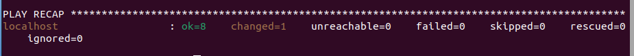
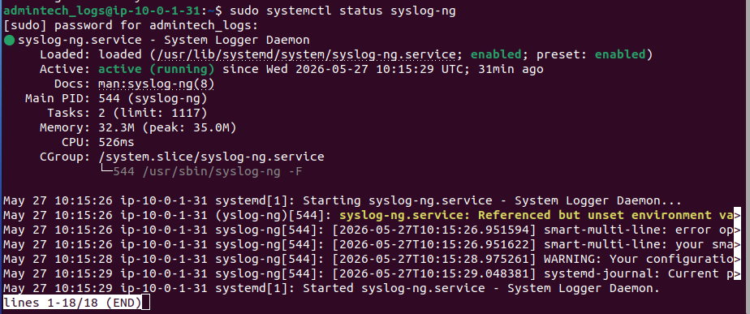
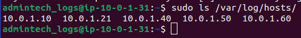
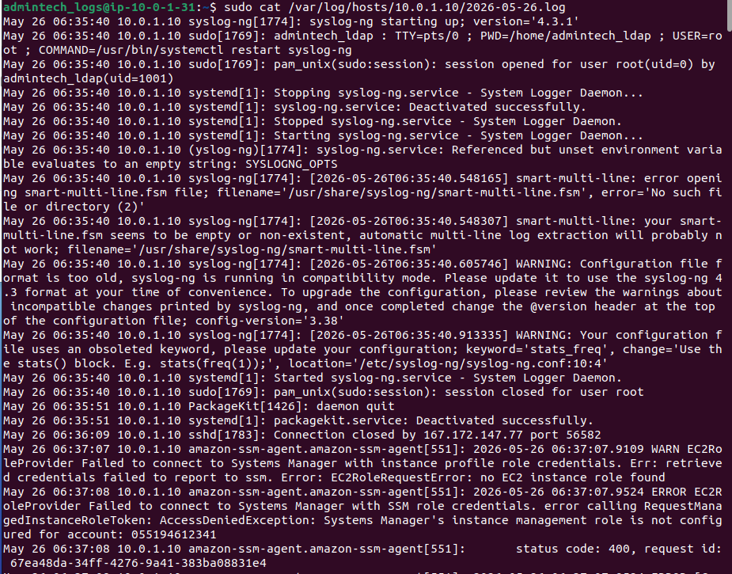

# 5. Logs centralitzats

**Servidor:** `logs-innovatetech` — `10.0.1.31`  
**IP pública:** `44.201.203.220` (dinàmica)  
**Software:** syslog-ng  
**Configurat amb:** Ansible

---

## 5.1 Descripció del servei

El servidor de logs centralitzats recull els registres de totes les màquines del projecte en un sol lloc. Això permet tenir una visió global de l'activitat de tota la infraestructura sense haver de connectar-se a cada màquina individualment.

S'ha escollit **syslog-ng** perquè és una eina molt flexible, permet rebre logs per UDP i TCP, i organitza els logs per màquina d'origen de forma automàtica.

---

## 5.2 Ansible

Tota la configuració d'aquesta màquina s'ha fet amb Ansible executat localment.

Vegeu el playbook complet: [playbook-logs.yml](../scripts/playbook-logs.yml)

### Execució del playbook

```bash
sudo ansible-playbook ~/ansible/playbook-logs.yml -i "localhost," -c local
```

> 

---

## 5.3 Configuració del servidor de logs

El servidor escolta connexions al port 514 (UDP i TCP) de totes les màquines de la VPC i desa els logs organitzats per màquina d'origen i data a `/var/log/hosts/IP/YYYY-MM-DD.log`.

S'utilitza el port 514 perquè és el port estàndard del protocol Syslog, que és el protocol universal per a l'enviament de logs entre sistemes Unix/Linux.

Tota la configuració del fitxer `/etc/syslog-ng/syslog-ng.conf` està automatitzada al playbook d'Ansible.

### Verificació que escolta al port 514

```bash
sudo systemctl status syslog-ng
```

> 

---

## 5.4 Configuració de les màquines clients

Cada màquina de la infraestructura té configurat syslog-ng per enviar els seus logs al servidor centralitzat (`10.0.1.31:514`). Quan una màquina genera un log (inici de sessió, error, canvi de configuració...) l'envia automàticament al servidor de logs.

### Màquines configurades

| Màquina | IP | Mètode |
|---------|-----|--------|
| LDAP | `10.0.1.10` | syslog-ng |
| Web | `10.0.1.21` | syslog-ng |
| BBDD | `10.0.1.40` | syslog-ng |
| Àudio | `10.0.1.50` | syslog-ng |
| Vídeo | `10.0.1.60` | syslog-ng |

---

## 5.5 Verificació

### Llistat de màquines que envien logs

```bash
sudo ls /var/log/hosts/
```

> 

### Contingut dels logs rebuts

```bash
sudo cat /var/log/hosts/10.0.1.10/2026-05-26.log
```

> 


