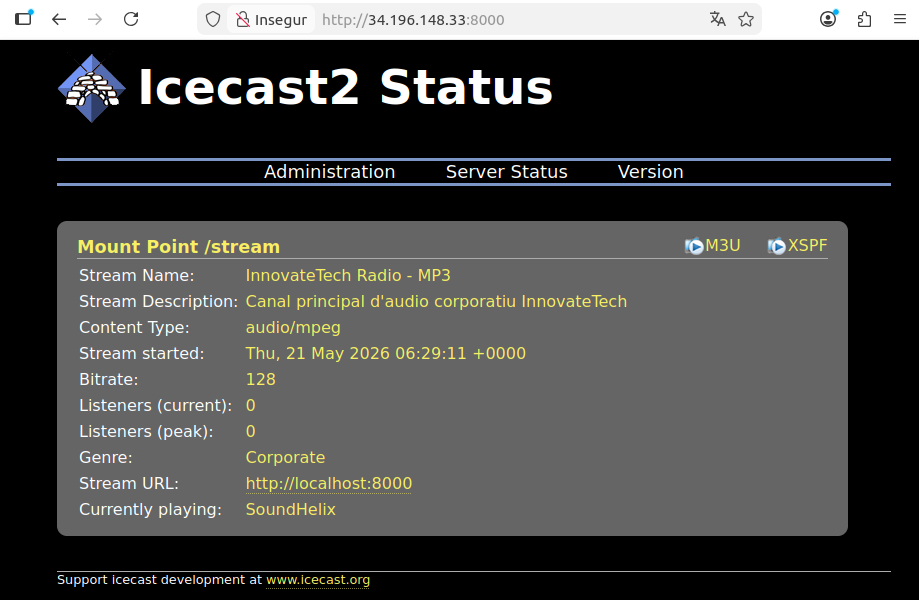

# 6. Servei d'àudio

## 6.1 Descripció del servei

El servei d'àudio permet la distribució de contingut sonor en temps real (streaming en directe) i sota demanda (on-demand) a través de la xarxa. Funciona amb una arquitectura client-servidor: el servidor rep una font d'àudio, la codifica en un format estàndard i la distribueix a múltiples clients simultàniament.

Per a InnovateTech, aquest servei cobreix les necessitats de comunicació interna i distribució de continguts corporatius.

---

## 6.2 Tecnologia escollida: Icecast2 + Liquidsoap

S'ha escollit **Icecast2** com a servidor de streaming d'àudio per les raons següents:

- Programari lliure i de codi obert, sense cost de llicència.
- Suporta els formats MP3, OGG Vorbis i AAC, tots estàndards del sector.
- Permet múltiples canals (mount points) simultanis.
- Ofereix accés via navegador web sense necessitat de programari addicional.
- Documentació àmplia i comunitat activa.

Com a font d'àudio s'utilitza **Liquidsoap**, que permet automatitzar la reproducció de fitxers i afegir lògica de programació.

---

## 6.3 Formats d'àudio utilitzats

| Format | Bitrate | Ús |
|--------|---------|----|
| MP3 | 128 kbps | Compatibilitat màxima amb clients |
| OGG Vorbis | 128 kbps | Qualitat superior, lliure de patents |
| AAC | 96 kbps | Optimitzat per a baixa amplada de banda |

S'ha escollit **MP3 a 128 kbps** com a format principal per la seva compatibilitat universal amb navegadors i clients de tots els sistemes operatius.

---

## 6.4 Arquitectura del servei

```
Fitxers MP3 → Liquidsoap → Icecast2 (port 8000) → Clients (navegador / VLC)
```

- **Liquidsoap** llegeix els fitxers d'àudio i envia el flux al servidor Icecast2 via protocol Shoutcast/Icecast.
- **Icecast2** rep el flux i el redistribueix als clients que es connectin.
- Els clients accedeixen mitjançant: `http://IP_SERVIDOR:8000/stream`

---

## 6.5 Instal·lació i configuració

**Instal·lació dels paquets:**
```bash
sudo apt-get update -y
sudo apt-get install -y icecast2 liquidsoap
```

**Configuració d'Icecast2** (`/etc/icecast2/icecast.xml`):
```xml
<authentication>
    <source-password>Aneto_3404</source-password>
    <relay-password>Aneto_3404</relay-password>
    <admin-user>admin</admin-user>
    <admin-password>Aneto_3404</admin-password>
</authentication>
<hostname>localhost</hostname>
```

**Configuració de Liquidsoap** (`/home/admintech_audio/liquidsoap.liq`):
```liquidsoap
#!/usr/bin/liquidsoap

log.file.path := "/var/log/liquidsoap/innovatetech.log"
log.level := 3

audio_source = playlist(
  mode="randomize",
  reload=3600,
  "/home/admintech_audio/audio"
)

audio_safe = fallback(
  track_sensitive=false,
  [audio_source, blank()]
)

audio_final = normalize(audio_safe)

output.icecast(
  %mp3(
    bitrate=128,
    samplerate=44100,
    stereo=true
  ),
  host="localhost",
  port=8000,
  password="Aneto_3404",
  mount="/stream",
  name="InnovateTech Radio - MP3",
  description="Canal principal d'àudio corporatiu InnovateTech",
  genre="Corporate",
  url="http://localhost:8000",
  public=false,
  audio_final
)
```

**Iniciar els serveis:**
```bash
sudo systemctl enable icecast2
sudo systemctl start icecast2
liquidsoap /home/admintech_audio/liquidsoap.liq &
```

---

## 6.6 Comprovació del servei

**Verificació de l'estat:**
```bash
sudo systemctl status icecast2
```

**Accés via navegador:**
- Panell d'administració: `http://IP_SERVIDOR:8000`
- Stream d'àudio: `http://IP_SERVIDOR:8000/stream`



> **Validació:** Stream d'àudio reproduint-se en temps real, accessible des del navegador i clients VLC.
