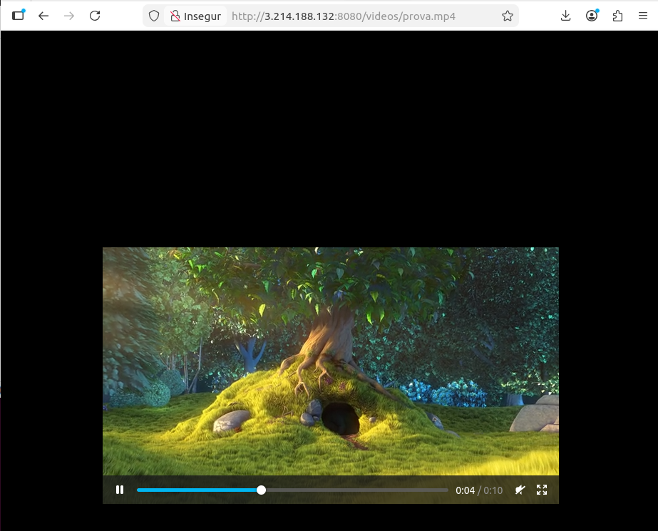
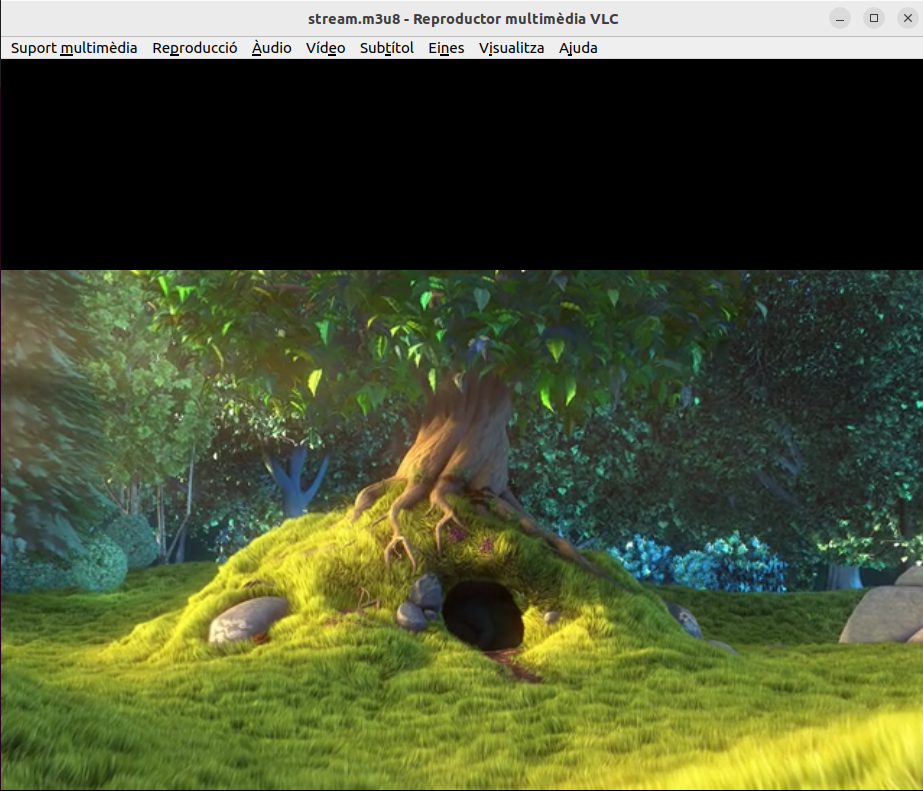
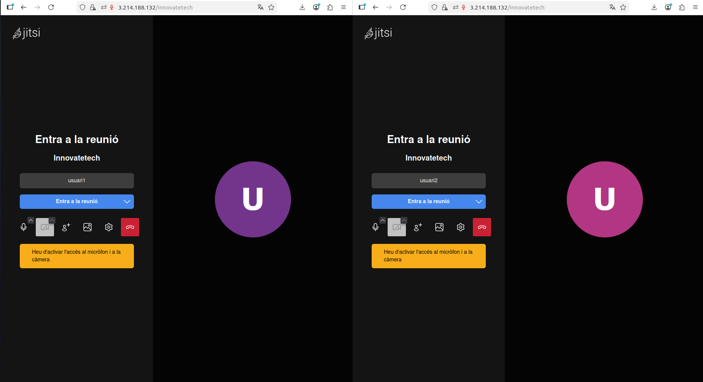

# 7. Servei de vídeo i videoconferència

## 7.1 Servei de vídeo

### 7.1.1 Descripció del servei

El servei de vídeo permet la distribució de contingut audiovisual en temps real (streaming en directe) i sota demanda (fitxers MP4). NGINX converteix el stream RTMP a HLS, compatible amb qualsevol navegador modern sense necessitat de programari addicional.

### 7.1.2 Tecnologia escollida: NGINX amb mòdul RTMP

S'ha escollit **NGINX amb el mòdul RTMP** per les raons següents:

- Programari lliure i de codi obert, sense cost de llicència.
- Suporta els protocols RTMP (recepció) i HLS (distribució als clients).
- Permet servir vídeos sota demanda (fitxers MP4) des del mateix servidor.
- Lleuger i eficient en consum de recursos.
- Estàndard en entorns empresarials.

### 7.1.3 Formats i còdecs utilitzats

| Format | Còdec | Ús |
|--------|-------|----|
| MP4 | H.264 | Vídeo sota demanda i streaming |
| HLS (.m3u8) | H.264 | Distribució als navegadors |
| RTMP | H.264 | Recepció del stream des de ffmpeg |

S'ha escollit **H.264** com a còdec principal per la seva compatibilitat universal amb navegadors, dispositius mòbils i reproductors de vídeo.

### 7.1.4 Protocols utilitzats

**RTMP (Real-Time Messaging Protocol):** Protocol usat per enviar el stream de vídeo des de ffmpeg cap al servidor NGINX. Funciona pel port 1935 i és el protocol estàndard per a la publicació de streams en entorns professionals.

**HLS (HTTP Live Streaming):** Protocol usat per distribuir el vídeo als clients. NGINX converteix automàticament el stream RTMP a HLS. El client rep fragments de vídeo de curta durada (`.ts`) i una llista de reproducció (`.m3u8`). Funciona pel port 8080 i és compatible amb qualsevol navegador modern.

### 7.1.5 Instal·lació i configuració

**Instal·lació dels paquets:**
```bash
sudo apt-get install -y nginx libnginx-mod-rtmp ffmpeg
sudo mkdir -p /home/admintech_video/videos
sudo mkdir -p /tmp/hls
sudo chmod 777 /tmp/hls
```

**Configuració de NGINX** (`/etc/nginx/nginx.conf`):
```nginx
load_module modules/ngx_rtmp_module.so;

user www-data;
worker_processes auto;
pid /run/nginx.pid;

events {
    worker_connections 768;
}

rtmp {
    server {
        listen 1935;
        chunk_size 4096;

        application live {
            live on;
            record off;
            hls on;
            hls_path /tmp/hls;
            hls_fragment 3s;
            hls_playlist_length 60s;
        }

        application vod {
            play /home/admintech_video/videos;
        }
    }
}

http {
    sendfile on;
    tcp_nopush on;
    include /etc/nginx/mime.types;
    default_type application/octet-stream;

    server {
        listen 8080;

        location /hls {
            types {
                application/vnd.apple.mpegurl m3u8;
                video/mp2t ts;
            }
            root /tmp;
            add_header Cache-Control no-cache;
            add_header Access-Control-Allow-Origin *;
        }

        location /videos {
            alias /home/admintech_video/videos;
            autoindex on;
            mp4;
            mp4_buffer_size 1m;
            mp4_max_buffer_size 5m;
            add_header Cache-Control no-cache;
            add_header Access-Control-Allow-Origin *;
        }
    }

    include /etc/nginx/sites-enabled/*.conf;
}
```

**Publicar stream amb ffmpeg:**
```bash
ffmpeg -re -stream_loop -1 -i /home/admintech_video/videos/prova.mp4 \
  -c copy -f flv rtmp://localhost:1935/live/stream > /dev/null 2>&1 &
```

### 7.1.6 Comprovació del servei

**Verificació de l'estat:**
```bash
sudo systemctl status nginx
```

**Accés als serveis:**
- Vídeo sota demanda: `http://IP_SERVIDOR:8080/videos/prova.mp4`
- Stream HLS: `http://IP_SERVIDOR:8080/hls/stream.m3u8`





> **Validació:** Vídeo accessible des del navegador web i des de VLC mitjançant el protocol HLS.

---

## 7.2 Servei de videoconferència

### 7.2.1 Descripció del servei

El servei de videoconferència permet la comunicació en temps real entre múltiples usuaris mitjançant àudio i vídeo. Està orientat a la comunicació interna d'InnovateTech i a sessions de formació corporativa.

### 7.2.2 Tecnologia escollida: Jitsi Meet

S'ha escollit **Jitsi Meet** per les raons següents:

- Programari lliure i de codi obert, sense cost de llicència.
- No requereix instal·lació de cap aplicació als clients: funciona directament des del navegador.
- Suporta videoconferències de múltiples participants simultanis.
- Inclou funcionalitats corporatives: compartir pantalla, xat, gravació.
- Solució de videoconferència autogestionada més estesa en entorns empresarials.

### 7.2.3 Protocol utilitzat: WebRTC

**WebRTC (Web Real-Time Communication)** és el protocol que usa Jitsi Meet per transmetre àudio i vídeo entre els participants:

- Comunicació directa entre navegadors sense necessitat de plugins.
- Xifrat extrem a extrem de l'àudio i el vídeo.
- Adaptació automàtica de la qualitat segons l'amplada de banda disponible.
- Funciona sobre UDP (port 10000) per minimitzar la latència.

### 7.2.4 Components de Jitsi Meet

| Component | Funció |
|-----------|--------|
| **Jitsi Meet** | Interfície web del client |
| **Jicofo** | Gestor de conferències (focus) |
| **Jitsi Videobridge (JVB)** | Servidor de vídeo WebRTC |
| **Prosody** | Servidor XMPP per a la senyalització |

### 7.2.5 Instal·lació i configuració

**Preparació de Lua 5.4** (requerit per Prosody a Ubuntu 24.04):
```bash
sudo apt-get install -y lua5.4 liblua5.4-dev
sudo update-alternatives --install /usr/bin/lua lua-interpreter /usr/bin/lua5.4 200
```

**Repositori i instal·lació de Prosody:**
```bash
wget https://prosody.im/files/prosody-debian-packages.key -O /tmp/prosody.key
sudo gpg --dearmor -o /usr/share/keyrings/prosody.gpg /tmp/prosody.key
echo "deb [signed-by=/usr/share/keyrings/prosody.gpg] http://packages.prosody.im/debian noble main" \
  | sudo tee /etc/apt/sources.list.d/prosody.list
sudo apt-get update -y
sudo apt-get install -y prosody
```

**Configuració de Prosody** (`/etc/prosody/prosody.cfg.lua`):
```lua
admins = { }
modules_enabled = {
    "roster"; "saslauth"; "tls"; "dialback"; "disco";
    "carbons"; "pep"; "private"; "blocklist";
    "version"; "uptime"; "time"; "ping"; "register";
}
allow_registration = false
c2s_require_encryption = false
s2s_require_encryption = false
authentication = "internal_hashed"
pidfile = "/run/prosody/prosody.pid"
log = {
    info = "/var/log/prosody/prosody.log";
    error = "/var/log/prosody/prosody.err";
}
data_path = "/var/lib/prosody"

VirtualHost "localhost"
```

**Repositori i instal·lació de Jitsi Meet:**
```bash
curl -fsSL https://download.jitsi.org/jitsi-key.gpg.key \
  | sudo gpg --dearmor -o /usr/share/keyrings/jitsi.gpg
echo "deb [signed-by=/usr/share/keyrings/jitsi.gpg] https://download.jitsi.org stable/" \
  | sudo tee /etc/apt/sources.list.d/jitsi-stable.list
sudo apt-get update -y
sudo apt-get install -y jitsi-meet
```

> Durant la instal·lació s'introdueix la IP pública com a domini i es genera un certificat self-signed.

**Integració amb NGINX existent** — afegir al bloc `http` de `/etc/nginx/nginx.conf`:
```nginx
include /etc/nginx/sites-enabled/*.conf;
```

### 7.2.6 Comprovació del servei

**Verificació de l'estat de tots els components:**
```bash
sudo systemctl status prosody
sudo systemctl status jicofo
sudo systemctl status jitsi-videobridge2
sudo systemctl status nginx
```

**Ports actius:**

| Port | Servei | Protocol |
|------|--------|----------|
| 80 | NGINX (redirect a HTTPS) | TCP |
| 443 | Jitsi Meet (HTTPS) | TCP |
| 8080 | NGINX vídeo | TCP |
| 10000 | Jitsi Videobridge | UDP |

**Accés al servei:** `https://IP_SERVIDOR`



> **Validació:** Dos usuaris (`usuari1` i `usuari2`) connectats simultàniament a la mateixa sala de videoconferència `Innovatetech`.

---

## 7.3 Incidències i solucions

| Incidència | Causa | Solució |
|------------|-------|---------|
| Prosody no arrencava | Conflicte entre Lua 5.1 i Lua 5.4 a Ubuntu 24.04 | Instal·lar Lua 5.4 des del repositori oficial i forçar la prioritat amb `update-alternatives` |
| Jitsi no escoltava al port 443 | El `nginx.conf` no incloïa el directori `sites-enabled` | Afegir `include /etc/nginx/sites-enabled/*.conf;` al bloc `http` |
| Prosody fallava sense VirtualHost | Fitxer de configuració sense cap `VirtualHost` definit | Afegir `VirtualHost "localhost"` al fitxer de configuració |
| Fitxers HLS no es generaven | Permisos incorrectes al directori `/tmp/hls` | Executar `sudo chmod 777 /tmp/hls` |
