# 3. Disseny i implementació d'una base de dades

## 3.1 Justificació del SGBD escollit

S'ha escollit **MySQL 8.0** com a sistema gestor de base de dades per les següents raons:

- És la versió disponible per defecte als repositoris oficials d'Ubuntu 24.04, sense necessitat d'instal·lació manual addicional.
- Suport natiu de rols a partir de la versió 8.0, necessari per implementar el control d'accés demanat per l'enunciat.
- Triggers, events periòdics i `SELECT INTO OUTFILE` per a backups funcionen directament sense configuració addicional.
- `GRANT FILE` disponible per permetre operacions d'escriptura de fitxers des del SGBD.
- Àmplia documentació oficial i comunitat de suport, facilitant la resolució d'incidències.

No s'ha utilitzat RDS d'AWS perquè té un cost elevat. La base de dades s'ha desplegat sobre una instància EC2 amb Ubuntu 24.04.

---

## 3.2 Diagrama Entitat-Relació

El diagrama E/R representa les 18 entitats de la base de dades d'InnovateTech, les seves relacions i cardinalitats. Les entitats s'han agrupat per colors segons la seva funció: blau per al personal, verd per als usuaris i clients, taronja per a les comunicacions, vermell per al comerç, gris per a l'auditoria i morat per als continguts multimèdia.


---

## 3.3 Model Relacional i descripció de les taules

A partir del diagrama E/R s'ha obtingut el següent esquema relacional. Les claus primàries estan **subratllades** i les claus foranes s'indiquen amb `→`:

**Departaments** (<u>codi_dept</u>, nom, telefon)
Emmagatzema els departaments de l'empresa. Cada departament té un identificador numèric únic, un nom i un telèfon de contacte. Els departaments definits són: Vendes, Suport Tècnic, Administració, Logística i Direcció.

**Grup_Nivell** (<u>id_grup_nivell</u>, nom, nivell, descripcio)
Defineix els nivells jeràrquics dins l'empresa, des de *Junior* (nivell 1) fins a *Direcció* (nivell 5). Permet classificar els empleats segons la seva experiència i responsabilitat.

**Empleats** (<u>dni</u>, nom, cognoms, adreca, telefon, codi_dept→Departaments, id_grup_nivell→Grup_Nivell)
Conté les dades personals i laborals de cada empleat. El DNI és l'identificador principal. Cada empleat pertany a un únic departament i té assignat un rang jeràrquic.

**Clients** (<u>id_client</u>, nom_complet, email, telefon)
Emmagatzema les dades dels clients externs que utilitzen els serveis o productes d'InnovateTech. Es diferencien dels empleats perquè no pertanyen a l'empresa.

**Grups_Qualitat** (<u>id_grup</u>, nom_grup, qualitat_video, qualitat_audio, bandwidth_max)
Defineix els nivells de qualitat disponibles per a les comunicacions multimèdia: alta (1080p), mitja (720p) i baixa (480p). S'assigna a cada usuari per establir la qualitat per defecte de les seves videoconferències segons la seva connexió.

**Config_Servidor** (<u>id_config</u>, parametre, valor, protocol, port)
Guarda els paràmetres de configuració del servidor de videoconferències: màxim de connexions, timeout de trucades, qualitat per defecte i màxim de participants. Permet modificar la configuració sense reiniciar el servei.

**Usuaris** (<u>id_usuari</u>, dni→Empleats, email, extensio, estat, id_grup_qualitat→Grups_Qualitat)
Representa els empleats que tenen accés al sistema de comunicació intern. Cada usuari té una extensió telefònica única, un estat (actiu/bloquejat) i un grup de qualitat assignat.

**Categories_Video** (<u>id_categoria</u>, nom)
Classifica els vídeos del catàleg en categories: Formació, Reunions, Presentacions, Tutorials i Comunicats Interns. Evita duplicitats i facilita les cerques.

**Videos** (<u>id_video</u>, titol, descripcio, id_categoria→Categories_Video, duracio, data_publicacio, url_streaming)
Emmagatzema el catàleg de vídeos disponibles al sistema de streaming, amb l'enllaç directe al servidor per accedir-hi.

**Productes** (<u>id_producte</u>, nom, descripcio, preu, estoc)
Conté els productes i serveis que InnovateTech ofereix als seus clients: llicències, serveis de suport, servidors virtuals, formació i consultoria.

**Comandes** (<u>id_comanda</u>, id_client→Clients, data_comanda, estat, total)
Registra les comandes realitzades pels clients. L'estat pot ser: pendent, processada, enviada, completada o cancel·lada.

**Cistell** (<u>id_cistell</u>, id_comanda→Comandes, id_producte→Productes, quantitat, preu_unitari)
Taula intermèdia que relaciona comandes amb productes, permetent que una comanda contingui múltiples productes amb les seves quantitats i preus.

**Nomines** (<u>id_nomina</u>, dni→Empleats, mes_any, salari_base, complements, deduccions, total_net)
Gestiona les nòmines mensuals dels empleats. Cada empleat té com a màxim una nòmina per mes, garantit per una clau única composta.

**Trucades** (<u>id_trucada</u>, id_usuari_origen→Usuaris, id_client_desti→Clients*, id_usuari_desti→Usuaris*, data_inici, data_fi, duracio_minuts, id_grup_qualitat→Grups_Qualitat, valoracio, comentari)
Registra totes les trucades i videoconferències. El destí pot ser un client extern o un usuari intern, però mai els dos alhora (constraint CHECK). Inclou la qualitat usada i la valoració opcional de l'usuari.

**Mesures_Bandwidth** (<u>id_mesura</u>, data_hora, id_usuari_operari→Usuaris, equip_mesurat, velocitat_baixada, velocitat_pujada, latencia, resultat, notes)
Emmagatzema les mesures d'ample de banda realitzades pels operaris. El resultat es classifica automàticament com a acceptable o no acceptable.

**Quotes_Usuari** (<u>id_quota</u>, id_usuari→Usuaris, mes_any, minuts_consumits, trucades_avui, limit_minuts_mes, limit_trucades_dia)
Controla el consum de trucades de cada usuari per mes. Cada usuari té límits personalitzats segons el seu rol i departament.

**Avisos** (<u>id_avis</u>, usuari_db, taula_afectada, operacio, data_hora, descripcio)
Taula d'auditoria que registra tots els intents d'accés no autoritzat. Utilitza motor **MyISAM** en lloc d'InnoDB per evitar que els registres es perdin quan un trigger llança un error i MySQL fa rollback.

**Backup_Log** (<u>id_backup</u>, data_hora, taules_incloses, resultat)
Registra cada execució del backup automàtic: quan s'ha executat, quines taules s'han inclòs i si ha tingut èxit.

---

## 3.4 Creació de les taules i inserció de dades

Les taules s'han creat seguint l'ordre correcte per respectar les dependències entre claus foranes, començant per les taules sense FKs i acabant per les que en depenen. S'han aplicat les restriccions adequades: `PRIMARY KEY`, `FOREIGN KEY`, `NOT NULL`, `UNIQUE` i `CHECK`.
A continuació es mostra la taula `Trucades` com a exemple, per ser la més complexa amb quatre claus foranes i la lògica de destí nullable:

([`creartaules.sql`](../sql/creartaules.sql))
([`trigger2.sql`](../sql/insertardades.sql))

```sql
CREATE TABLE Trucades (
    id_trucada          INT             NOT NULL AUTO_INCREMENT,
    id_usuari_origen    INT             NOT NULL,
    id_client_desti     INT,
    id_usuari_desti     INT,
    data_inici          DATETIME        NOT NULL,
    data_fi             DATETIME,
    duracio_minuts      DECIMAL(10,2),
    id_grup_qualitat    INT             NOT NULL,
    valoracio           INT,
    comentari           TEXT,

    CONSTRAINT pk_trucades PRIMARY KEY (id_trucada),
    CONSTRAINT fk_trucades_origen FOREIGN KEY (id_usuari_origen)
        REFERENCES Usuaris(id_usuari),
    CONSTRAINT fk_trucades_client FOREIGN KEY (id_client_desti)
        REFERENCES Clients(id_client),
    CONSTRAINT fk_trucades_usuari_desti FOREIGN KEY (id_usuari_desti)
        REFERENCES Usuaris(id_usuari),
    CONSTRAINT fk_trucades_qualitat FOREIGN KEY (id_grup_qualitat)
        REFERENCES Grups_Qualitat(id_grup),
    CONSTRAINT chk_desti CHECK (
        id_client_desti IS NOT NULL OR id_usuari_desti IS NOT NULL
    ),
    CONSTRAINT chk_valoracio CHECK (valoracio BETWEEN 1 AND 5)
);
```

```sql
INSERT INTO Trucades (id_usuari_origen, id_client_desti, id_usuari_desti, data_inici, data_fi, durac>
(1, 1, NULL, '2025-03-01 09:00:00', '2025-03-01 09:25:00', 25.00, 1, 5, 'Excel·lent atenció'),
(2, 2, NULL, '2025-03-01 10:00:00', '2025-03-01 10:15:00', 15.00, 1, 4, 'Bona trucada'),
(3, NULL, 4, '2025-03-02 11:00:00', '2025-03-02 11:30:00', 30.00, 2, NULL, NULL),
(4, 3, NULL, '2025-03-02 12:00:00', '2025-03-02 12:10:00', 10.00, 2, 3, 'Acceptable'),
(5, NULL, 6, '2025-03-03 09:30:00', '2025-03-03 09:45:00', 15.00, 2, NULL, NULL),
(1, 4, NULL, '2025-03-03 10:00:00', '2025-03-03 10:45:00', 45.00, 1, 5, 'Molt satisfactori'),
(7, NULL, 8, '2025-03-04 11:00:00', '2025-03-04 11:20:00', 20.00, 3, NULL, NULL),
(9, 5, NULL, '2025-03-04 12:00:00', '2025-03-04 12:30:00', 30.00, 1, 4, 'Bona gestió');
```

Verificació de les 18 taules creades correctament:

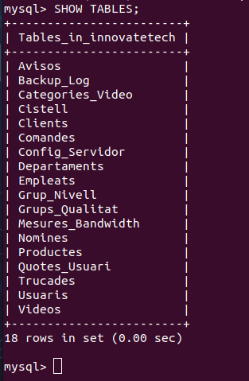

### Ampliació: Inserció automàtica de mesures d'ample de banda

S'ha implementat un script Bash ([`amplebanda.sh`](../scripts/amplebanda.sh)) que executa `speedtest-cli` automàticament i insereix els resultats directament a la taula `Mesures_Bandwidth`, classificant el resultat com a acceptable o no acceptable segons uns llindars mínims definits (10 Mbps baixada, 5 Mbps pujada, latència < 100ms).

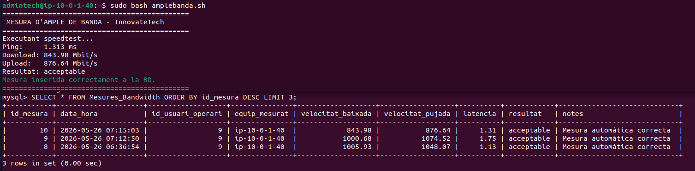

---

## 3.5 Rols i permisos

### Rols demanats per l'enunciat

| Rol | Permisos principals | Restriccions |
|---|---|---|
| `admin` | Accés total a totes les taules | Pot gestionar altres usuaris i la taula d'avisos |
| `vendes` | SELECT, INSERT, UPDATE sobre Clients, Comandes, Productes, Cistell, Trucades | No pot modificar taules de personal ni nòmines |
| `administracio` | SELECT, INSERT, UPDATE sobre Empleats, Nomines, Departaments, Grup_Nivell | No pot accedir al sistema de trucades de clients |
| `treballador` | SELECT sobre Productes, Videos, Config_Servidor. SELECT i INSERT sobre Trucades | No pot modificar taules de personal ni nòmines |
([`crear_rols`](../sql/crear_rols.sql))
### Rols creats

```sql
CREATE ROLE IF NOT EXISTS 'admin';
CREATE ROLE IF NOT EXISTS 'vendes';
CREATE ROLE IF NOT EXISTS 'administracio';
CREATE ROLE IF NOT EXISTS 'treballador';

-- Exemple permisos rol vendes
GRANT SELECT, INSERT, UPDATE ON innovatetech.Clients TO 'vendes';
GRANT SELECT, INSERT, UPDATE ON innovatetech.Comandes TO 'vendes';
GRANT SELECT, INSERT, UPDATE ON innovatetech.Productes TO 'vendes';
GRANT SELECT, INSERT, UPDATE ON innovatetech.Cistell TO 'vendes';
GRANT SELECT, INSERT, UPDATE ON innovatetech.Trucades TO 'vendes';
```

### Verificació dels permisos

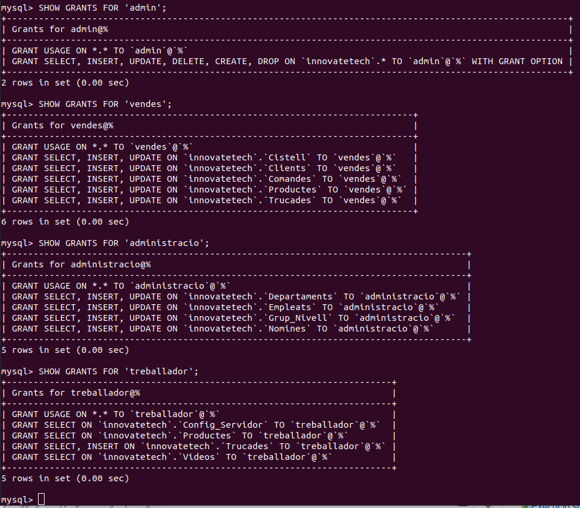

---

## 3.6 Script de creació automatitzada d'usuaris

S'ha creat un script en Bash ([`scriptusuaris.sh`](../scripts/scriptusuaris.sh)) que automatitza la creació d'usuaris a la base de dades amb les següents funcionalitats:

- Permet donar d'alta un o més usuaris alhora.
- Executa les sentències `CREATE USER` i `GRANT` corresponents al rol assignat.
- Genera un fitxer `usuaris_creats.sql` amb les sentències SQL resultants per poder revisar-les i executar-les posteriorment.
- Assigna el rol correcte a cada usuari en el moment de la creació.
- Gestiona errors: usuari ja existent, rol no vàlid.
- Assigna `GRANT FILE` per permetre operacions de backup.

Demostració d'execució creant dos usuaris:

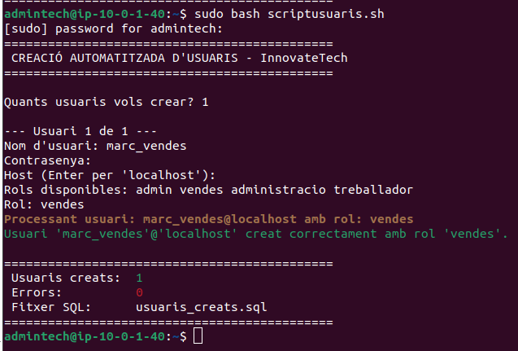

**Nota important:** Els usuaris creats han de seguir la convenció de nom nomUsuari_rol (per exemple: marc_vendes, anna_administracio). Els triggers d'auditoria identifiquen el rol de l'usuari mitjançant la funció USER() de MySQL, que retorna el nom de l'usuari connectat. Si un usuari no segueix aquesta convenció, els triggers no el detectaran correctament i les operacions no autoritzades no quedaran registrades a la taula Avisos.

El fitxer `usuaris_creats.sql` generat automàticament conté les sentències SQL per poder revisar i executar posteriorment:

```sql
-- Usuari: user_vendes@localhost | Rol: vendes
CREATE USER 'user_vendes'@'localhost' IDENTIFIED BY '***';
GRANT 'vendes' TO 'user_vendes'@'localhost';
SET DEFAULT ROLE 'vendes' TO 'user_vendes'@'localhost';
GRANT FILE ON *.* TO 'user_vendes'@'localhost';
FLUSH PRIVILEGES;

-- Usuari: user_administracio@localhost | Rol: administracio
CREATE USER 'user_administracio'@'localhost' IDENTIFIED BY '***';
GRANT 'administracio' TO 'user_administracio'@'localhost';
SET DEFAULT ROLE 'administracio' TO 'user_administracio'@'localhost';
GRANT FILE ON *.* TO 'user_administracio'@'localhost';
FLUSH PRIVILEGES;
```

---

## 3.7 Triggers i comprovacions

S'han implementat cinc triggers per garantir la seguretat i el control d'accés. Tots els triggers que bloquegen operacions registren prèviament l'intent a la taula `Avisos` (motor MyISAM) abans de llançar l'error, garantint que el registre d'auditoria no es perdi mai.

### Trigger 1 — Bloqueig d'usuaris

Impedeix que un usuari amb estat `bloquejat` pugui realitzar o rebre trucades. S'executa `BEFORE INSERT` a `Trucades`, comprova l'estat tant de l'usuari origen com del destí (si és intern), registra l'intent a `Avisos` i llança un `SIGNAL` per bloquejar l'operació.
([`trigger1.sql`](../sql/trigger_bloqueig.sql))
```sql
CREATE TRIGGER trg_bloqueig_usuari
BEFORE INSERT ON Trucades
FOR EACH ROW
BEGIN
    DECLARE estat_origen VARCHAR(10);
    SELECT estat INTO estat_origen
    FROM Usuaris WHERE id_usuari = NEW.id_usuari_origen;

    IF estat_origen = 'bloquejat' THEN
        INSERT INTO Avisos (usuari_db, taula_afectada, operacio, descripcio)
        VALUES (USER(), 'Trucades', 'INSERT',
            CONCAT('Intent de trucada bloquejat. Usuari origen: ', NEW.id_usuari_origen));
        SIGNAL SQLSTATE '45000'
        SET MESSAGE_TEXT = 'ERROR: L usuari origen està bloquejat i no pot realitzar trucades.';
    END IF;
END
```

Comprovació — l'usuari 8 (Elena Llop) té estat `bloquejat`:

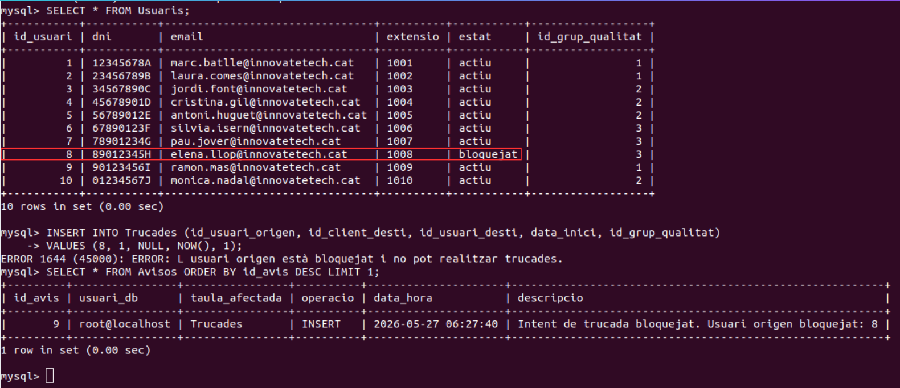

### Trigger 2 — Control de quota de minuts mensuals
Impedeix noves trucades si l'usuari ha superat els minuts mensuals assignats. Consulta la taula `Quotes_Usuari` filtrant pel mes actual amb `DATE_FORMAT(NOW(), '%Y-%m')` i compara els minuts consumits amb el límit.
([`trigger2.sql`](../sql/trigger_trucades_mensuals.sql))
```sql
CREATE TRIGGER trg_control_minuts
BEFORE INSERT ON Trucades
FOR EACH ROW
BEGIN
    DECLARE v_minuts_actuals DECIMAL(10,2);
    DECLARE v_limit_minuts INT;

    SELECT minuts_consumits, limit_minuts_mes
    INTO v_minuts_actuals, v_limit_minuts
    FROM Quotes_Usuari
    WHERE id_usuari = NEW.id_usuari_origen
    AND mes_any = DATE_FORMAT(NOW(), '%Y-%m');

    IF v_minuts_actuals IS NOT NULL AND (v_minuts_actuals >= v_limit_minuts) THEN
        INSERT INTO Avisos (usuari_db, taula_afectada, operacio, descripcio)
        VALUES (USER(), 'Trucades', 'INSERT',
            CONCAT('Quota de minuts superada per usuari: ', NEW.id_usuari_origen));
        SIGNAL SQLSTATE '45000'
        SET MESSAGE_TEXT = 'ERROR: Has superat la quota de minuts mensuals.';
    END IF;
END
```

Comprovació — posem l'usuari 1 al límit de minuts i intentem una trucada:

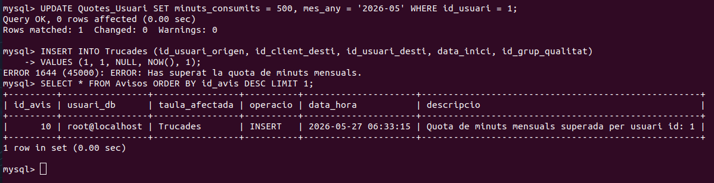

### Trigger 3 — Control de trucades diàries
Impedeix noves trucades si l'usuari ha superat el nombre màxim de trucades diàries. Funciona igual que el trigger de minuts però comprovant el camp `trucades_avui`. S'han usat noms de variables amb prefix `v_` per evitar conflictes amb els noms dels camps de la taula.
([`trigger1.sql`](../sql/trigger_trucadesdiariessql))
```sql
CREATE TRIGGER trg_control_trucades_dia
BEFORE INSERT ON Trucades
FOR EACH ROW
BEGIN
    DECLARE v_trucades_avui INT;
    DECLARE v_limit_trucades INT;

    SELECT trucades_avui, limit_trucades_dia
    INTO v_trucades_avui, v_limit_trucades
    FROM Quotes_Usuari
    WHERE id_usuari = NEW.id_usuari_origen
    AND mes_any = DATE_FORMAT(NOW(), '%Y-%m');

    IF v_trucades_avui IS NOT NULL AND (v_trucades_avui >= v_limit_trucades) THEN
        INSERT INTO Avisos (usuari_db, taula_afectada, operacio, descripcio)
        VALUES (USER(), 'Trucades', 'INSERT',
            CONCAT('Quota diària superada per usuari: ', NEW.id_usuari_origen));
        SIGNAL SQLSTATE '45000'
        SET MESSAGE_TEXT = 'ERROR: Has superat el nombre màxim de trucades diàries.';
    END IF;
END
```

Comprovació — posem l'usuari 1 al límit de trucades diàries:

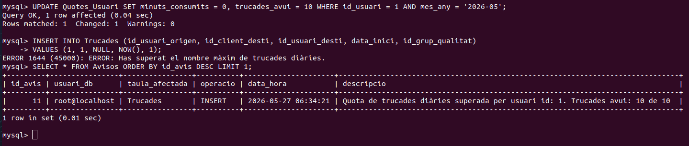

### Trigger 4 — Auditoria d'accés a Nòmines
Registra i bloqueja qualsevol intent de modificació de la taula `Nòmines` per part d'usuaris amb rol `vendes` o `treballador`. S'identifica el rol de l'usuari mitjançant la funció `USER()` de MySQL, que retorna el nom de l'usuari connectat.
([`trigger4.sql`](../sql/triggeraudit/vendes_audit.sql))
```sql
CREATE TRIGGER trg_audit_nomines
BEFORE UPDATE ON Nomines
FOR EACH ROW
BEGIN
    IF USER() LIKE '%vendes%' OR USER() LIKE '%treballador%' THEN
        INSERT INTO Avisos (usuari_db, taula_afectada, operacio, descripcio)
        VALUES (USER(), 'Nomines', 'UPDATE',
            CONCAT('Intent no autoritzat de modificar Nomines: ', USER()));
        SIGNAL SQLSTATE '45000'
        SET MESSAGE_TEXT = 'ERROR: No tens permisos per modificar la taula Nomines.';
    END IF;
END
```

Comprovació — connectats amb l'usuari `test_vendes`:

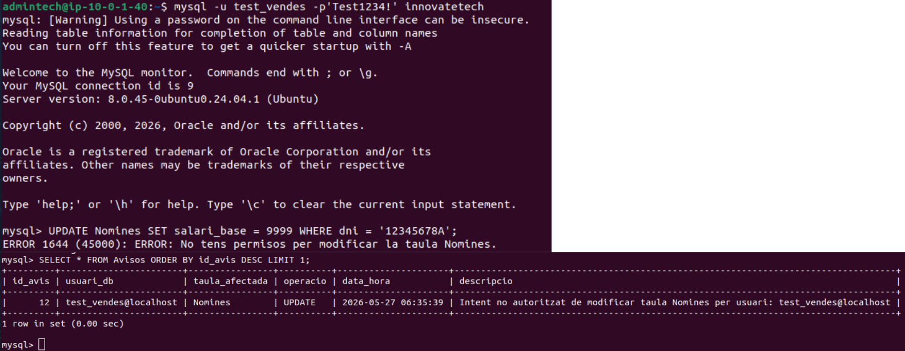

### Trigger 5 — Auditoria d'accés a Trucades

Registra i bloqueja qualsevol intent d'accés a la taula `Trucades` per part d'usuaris amb rol `administracio`, que per definició no hauria de poder gestionar trucades de clients.
([`trigger5.sql`](../sql/triggeraudit/audit_trucades.sql))
```sql
CREATE TRIGGER trg_audit_trucades
BEFORE INSERT ON Trucades
FOR EACH ROW
BEGIN
    IF USER() LIKE '%administracio%' THEN
        INSERT INTO Avisos (usuari_db, taula_afectada, operacio, descripcio)
        VALUES (USER(), 'Trucades', 'INSERT',
            CONCAT('Intent no autoritzat d accés a Trucades: ', USER()));
        SIGNAL SQLSTATE '45000'
        SET MESSAGE_TEXT = 'ERROR: No tens permisos per accedir a les trucades de clients.';
    END IF;
END
```

Comprovació — connectats amb l'usuari `test_administracio`:

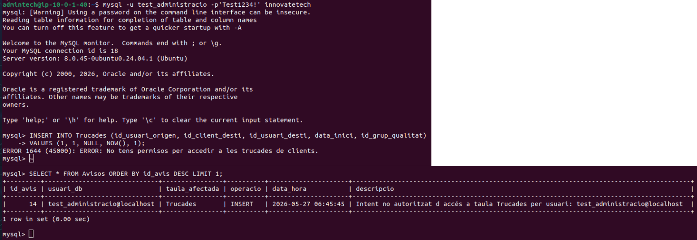

### Ampliació: Notificacions automàtiques a Discord

S'ha implementat un script Bash ([`notificacions_discord.sh`](../scripts/notificacions_discord.sh)) que revisa periòdicament la taula `Avisos` i envia una notificació al canal `#avisos-seguretat` de Discord via webhook quan detecta nous intents d'accés no autoritzat.

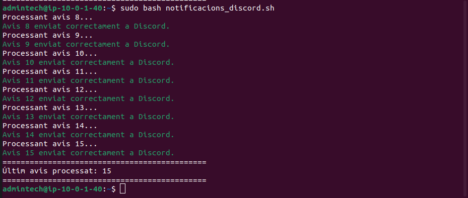

L'script manté un fitxer de control (`last_avis_id.txt`) per recordar l'últim avís processat i evitar notificacions duplicades. Cada notificació inclou: ID de l'avís, usuari de BD, taula afectada, operació intentada, data i hora i descripció.

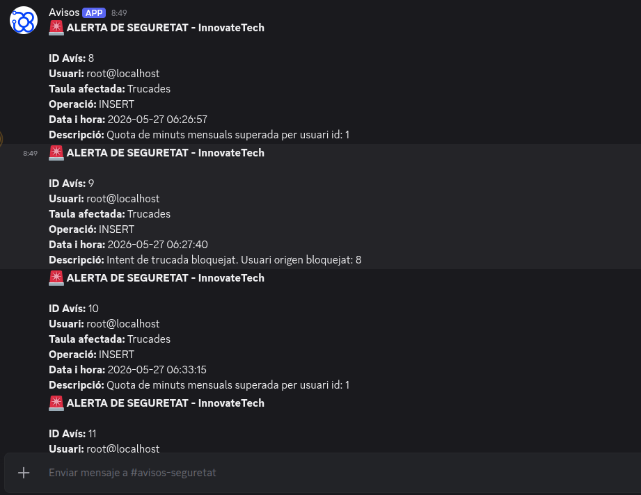

---

## 3.8 Backup

S'ha creat un event periòdic (`evt_backup_diari`) que s'executa automàticament cada dia a les **02:00 AM**. S'ha escollit aquesta hora perquè és el moment de menor activitat del sistema, minimitzant l'impacte en el rendiment.

L'event realitza còpies de seguretat de les quatre taules crítiques en format CSV al directori `/var/lib/mysql/backup/`:

| Taula | Fitxer generat |
|---|---|
| Empleats | `empleats.csv` |
| Clients | `clients.csv` |
| Trucades | `trucades.csv` |
| Mesures_Bandwidth | `mesures_bandwidth.csv` |

Cada execució queda registrada automàticament a la taula `Backup_Log` amb la data, les taules incloses i el resultat.

```sql
CREATE EVENT evt_backup_diari
ON SCHEDULE EVERY 1 DAY
STARTS '2025-05-21 02:00:00'
DO
BEGIN
    SELECT * INTO OUTFILE '/var/lib/mysql/backup/empleats.csv'
    FIELDS TERMINATED BY ',' ENCLOSED BY '"'
    LINES TERMINATED BY '\n'
    FROM Empleats;

    SELECT * INTO OUTFILE '/var/lib/mysql/backup/clients.csv'
    FIELDS TERMINATED BY ',' ENCLOSED BY '"'
    LINES TERMINATED BY '\n'
    FROM Clients;

    SELECT * INTO OUTFILE '/var/lib/mysql/backup/trucades.csv'
    FIELDS TERMINATED BY ',' ENCLOSED BY '"'
    LINES TERMINATED BY '\n'
    FROM Trucades;

    SELECT * INTO OUTFILE '/var/lib/mysql/backup/mesures_bandwidth.csv'
    FIELDS TERMINATED BY ',' ENCLOSED BY '"'
    LINES TERMINATED BY '\n'
    FROM Mesures_Bandwidth;

    INSERT INTO Backup_Log (taules_incloses, resultat)
    VALUES ('Empleats, Clients, Trucades, Mesures_Bandwidth', 'correcte');
END
```

Verificació de l'event actiu i registre a `Backup_Log`:

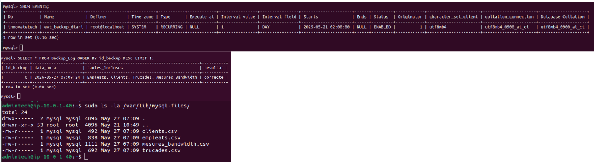

([`backup.sql`](../sql/backup.sql))


**Nota:** El event backup es recurrent, es realitza a les 2:00 AM. Però per fer la comprovació hem canviat el event per a que es faci una vegada ara mateix.
