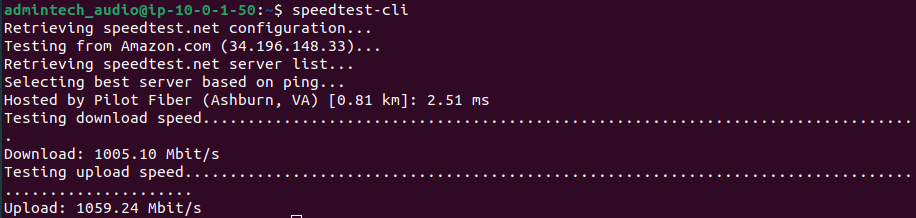
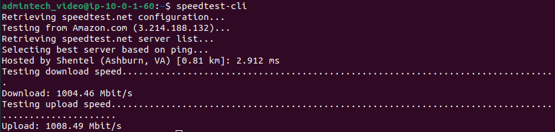

# 9. Comprovacions d'amplada de banda

## 9.1 Objectiu

Garantir que la infraestructura desplegada és capaç de suportar els serveis d'àudio, vídeo i videoconferència sense degradació del servei. Les proves es realitzen des de cada màquina AWS per mesurar la capacitat real de la infraestructura.

---

## 9.2 Metodologia

Les proves s'han realitzat amb l'eina `speedtest-cli` directament des de cada instància EC2, amb els serveis actius en el moment de la mesura.

**Instal·lació de l'eina:**
```bash
sudo apt-get install -y speedtest-cli
speedtest-cli
```

---

## 9.3 Resultats de les proves

### Prova 1 — Màquina d'àudio (Icecast2 actiu)

Prova realitzada amb el servei Icecast2 en funcionament i Liquidsoap reproduint el stream de música corporativa.



| Mesura | Resultat |
|--------|----------|
| Servidor de prova | Pilot Fiber (Ashburn, VA) |
| Latència | 2.51 ms |
| Download | 1005.10 Mbit/s |
| Upload | 1059.24 Mbit/s |

### Prova 2 — Màquina de vídeo (NGINX + Jitsi actius)

Prova realitzada amb el servei NGINX en funcionament, el vídeo `prova.mp4` reproduint-se al navegador i Jitsi Meet actiu.



| Mesura | Resultat |
|--------|----------|
| Servidor de prova | Shentel (Ashburn, VA) |
| Latència | 2.912 ms |
| Download | 1004.46 Mbit/s |
| Upload | 1008.49 Mbit/s |

---

## 9.4 Anàlisi dels resultats

### Relació amb els serveis multimèdia

| Servei | Ample de banda mínim requerit | Disponible | Resultat |
|--------|-------------------------------|------------|----------|
| Streaming d'àudio MP3 128 kbps | ~0.2 Mbps per client | 1005 Mbps | ✅ Acceptable |
| Streaming de vídeo HLS 360p | ~1 Mbps per client | 1004 Mbps | ✅ Acceptable |
| Videoconferència WebRTC | ~1.5 Mbps per participant | 1004 Mbps | ✅ Acceptable |

### Capacitat estimada de la infraestructura

Amb els resultats obtinguts, la infraestructura pot suportar simultàniament:

- **Àudio:** fins a ~5000 clients connectats al stream MP3 de 128 kbps
- **Vídeo:** fins a ~1000 clients reproduint vídeo HLS a 360p
- **Videoconferència:** fins a ~670 participants simultanis en videoconferències WebRTC

---

## 9.5 Classificació del sistema

| Criteri | Valor | Classificació |
|---------|-------|---------------|
| Latència | < 5 ms | ✅ Excel·lent |
| Download | > 1000 Mbps | ✅ Excel·lent |
| Upload | > 1000 Mbps | ✅ Excel·lent |
| **Sistema global** | | ✅ **Acceptable** |

---

## 9.6 Conclusió tècnica

La infraestructura AWS desplegada ofereix una amplada de banda molt superior als requisits mínims de tots els serveis multimèdia implementats. Amb més d'**1 Gbps** tant de baixada com de pujada i una latència inferior a **3 ms**, la infraestructura és completament adequada per donar suport als serveis d'àudio, vídeo i videoconferència d'InnovateTech, fins i tot amb un nombre elevat d'usuaris simultanis.

Les instàncies EC2 d'AWS ubicades a la regió `us-east-1` garanteixen una connectivitat òptima i uns temps de resposta molt baixos, cosa que assegura una experiència d'usuari de qualitat sense degradació del servei.
